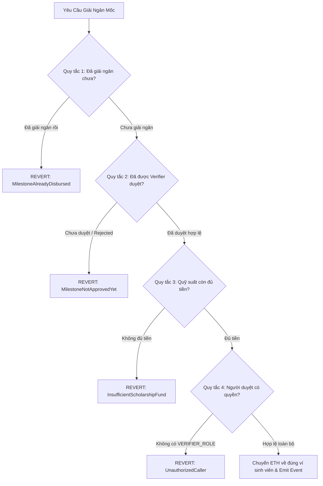

# Quy Tắc Kinh Tế & Kiểm Soát Rủi Ro (Economic Rules) - TrustScholar

> **Dự án:** TrustScholar — Nền tảng giải ngân học bổng minh bạch trên Blockchain  
> **Phiên bản:** v1.0 (Quy tắc kinh tế, dòng tiền & bảo vệ nguồn quỹ)  
> **Repository GitHub:** [minhkhanhlinh2108-wq/LinhHuynhK58KTS](https://github.com/minhkhanhlinh2108-wq/LinhHuynhK58KTS)  
> **Điều hướng nhanh:** [Trang chủ README](../README.md) | [Đặc Tả Nghiệp Vụ (SPEC.md)](SPEC.md) | [Kế Hoạch Đồ Án (PROJECT_PLAN.md)](PROJECT_PLAN.md) | [Nhật Ký AI (AI_JOURNAL.md)](AI_JOURNAL.md)  
> **Mô tả:** Tài liệu này xác định mô hình kinh tế, cơ chế khuyến khích, phân định quyền hạn và các phương án giảm thiểu rủi ro tài chính cho nền tảng giải ngân học bổng TrustScholar.

---

## 1. Dòng Tiền & Quyền Lợi (Cashflow & Value Incentives)

Hệ thống TrustScholar vận hành theo cơ chế ký quỹ thông minh phi lưu ký (Non-custodial Escrow), bảo đảm từng đồng tiền đóng góp của Nhà tài trợ được giám sát chặt chẽ và giải ngân chính xác theo các nguyên tắc sau:

### 1.1. Nhà Tài Trợ Đưa ETH Testnet Vào Quỹ
- **Dòng tiền nạp (Funding Inflow):** Nhà tài trợ (Sponsor) chuyển trực tiếp đồng tiền mã hóa thử nghiệm (ETH Testnet trên mạng Sepolia/Arbitrum Sepolia) vào Smart Contract của TrustScholar thông qua giao dịch `depositFund`.
- **Minh bạch ký quỹ:** Toàn bộ số dư nạp vào được ghi nhận công khai trên sổ cái blockchain, phát sinh sự kiện `FundDeposited` để mọi bên đều có thể đối soát.
- **Trách nhiệm phí gas:** Nhà tài trợ tự chi trả phí gas mạng lưới khi thực hiện khởi tạo và nạp tiền vào quỹ.

### 1.2. Tiền Được Khóa Theo Từng Suất Học Bổng
- **Hạch toán độc lập (Escrow Per Scholarship):** Tiền không bị hòa lẫn vào một bể chung vô định, mà được phân bổ và khóa cứng (locked) tương ứng với từng mã suất học bổng duy nhất (`scholarshipId`).
- **Phân bổ theo mốc (Milestone Allocation):** Số tiền khóa cho mỗi suất được chia nhỏ thành các mốc giải ngân (`milestoneAmounts[i]`). Tổng giá trị các mốc bắt buộc phải bằng chính xác tổng giá trị suất học bổng:
  $$\sum_{i=0}^{n-1} \text{milestoneAmounts}[i] = \text{totalAmount}$$
- **Bảo toàn khả năng thanh toán (Solvency Guarantee):** Khi suất đã được nạp đủ tiền (`Funded`), số tiền này bị phong tỏa trong hợp đồng và chỉ được giải phóng cho hai trường hợp: (1) giải ngân cho sinh viên khi hoàn thành mốc, hoặc (2) hoàn trả lại cho Nhà tài trợ nếu mốc bị hủy hợp lệ sau thời gian ân hạn quy định.

### 1.3. Sinh Viên Chỉ Nhận Tiền Khi Đạt Điều Kiện
- **Điều kiện kép (Two-condition Gate):** Sinh viên không thể tự ý rút tiền học bổng ngay sau khi được cấp suất, mà bắt buộc phải vượt qua 2 bước kiểm tra:
  1. *Nộp minh chứng:* Sinh viên phải nộp mã băm minh chứng (`proofHash` / IPFS CID) chứng minh hoàn thành mốc học tập/nghiên cứu trước hạn chót.
  2. *Thẩm định độc lập:* Người xác thực có thẩm quyền (`VERIFIER_ROLE`) phải thẩm định minh chứng off-chain và ký giao dịch xác nhận mốc đạt yêu cầu (`approveMilestone`).
- **Không đạt - Không giải ngân:** Nếu sinh viên không nộp minh chứng hoặc minh chứng không đạt tiêu chuẩn, trạng thái mốc sẽ không chuyển sang `Approved`, Smart Contract tuyệt đối từ chối lệnh chuyển tiền.

### 1.4. Tiền Phải Đến Đúng Ví Sinh Viên
- **Chuyển tiền trực tiếp (Direct Payout):** Tiền giải ngân của từng mốc được chuyển thẳng từ số dư ký quỹ của hợp đồng vào chính xác địa chỉ ví cá nhân của sinh viên (`scholarship.studentAddress`) đã được ấn định trong hợp đồng.
- **Không qua trung gian (Zero Intermediary):** Hệ thống không chuyển tiền qua ví của người duyệt, ví admin, hay bất kỳ tài khoản trung gian nào.
- **Không thu phí khấu trừ (Zero Platform Fee):** Sinh viên nhận trọn vẹn 100% số tiền học bổng của mốc cam kết mà không bị cắt xén hoa hồng nền tảng.

---

## 2. Giới Hạn Chống Lạm Dụng (Abuse Prevention & Constraints)

Nhằm triệt tiêu mọi khả năng gian lận, trục lợi hoặc khai thác lỗ hổng kỹ thuật, Smart Contract thiết lập 4 giới hạn cứng bất biến (Invariants):



### 2.1. Không Giải Ngân Hai Lần Cho Cùng Một Mốc (No Double Disbursement)
- **Cơ chế trạng thái một chiều (One-way State Transition):** Mỗi mốc học bổng chỉ được chuyển sang trạng thái `Disbursed` đúng 01 lần duy nhất trong toàn bộ vòng đời.
- **Kiểm soát Checks-Effects-Interactions (CEI):** Khi thực hiện lệnh giải ngân, hợp đồng kiểm tra cờ `milestone.status == MilestoneStatus.Approved`, ngay lập tức cập nhật trạng thái `milestone.status = MilestoneStatus.Disbursed` và cộng dồn `scholarship.disbursedAmount += milestone.amount` trước khi thực hiện chuyển ETH.
- **Chống tấn công tái nhập (Reentrancy Guard):** Sử dụng khóa chống tái nhập `nonReentrant` cho toàn bộ các hàm rút/chuyển tiền.

### 2.2. Không Giải Ngân Khi Chưa Đủ Điều Kiện (No Unapproved Disbursement)
- **Khóa logic nghiêm ngặt:** Hàm giải ngân bắt buộc phải xác thực điều kiện `milestone.status == MilestoneStatus.Approved`. 
- Bất kỳ nỗ lực gọi giải ngân nào khi mốc đang ở trạng thái `Pending` (chờ nộp minh chứng) hoặc `Submitted` (mới nộp minh chứng, chưa được duyệt) đều bị lập tức đảo ngược giao dịch (revert) với lỗi `MilestoneNotApprovedYet`.
- Ngăn chặn việc sinh viên tự kích hoạt nhận tiền khi chưa có xác nhận từ người có thẩm quyền.

### 2.3. Không Giải Ngân Vượt Số Tiền Đã Cấp (Solvency & Overdraft Prevention)
- **Bảo toàn hạn mức ký quỹ:** Tổng số tiền giải ngân lũy kế của một suất học bổng tuyệt đối không bao giờ được vượt quá số tiền thực tế mà Nhà tài trợ đã nạp vào hợp đồng:
  $$\text{scholarship.disbursedAmount} + \text{milestoneAmount} \le \text{scholarship.fundedAmount}$$
- **Hạch toán cô lập:** Nghiêm cấm việc lấy tiền ký quỹ của suất học bổng A để chi trả cho suất học bổng B. Nếu một suất học bổng chưa được nạp đủ tiền cho mốc tiếp theo, hệ thống sẽ từ chối giải ngân thay vì rút lẹm vào số dư của các suất khác.

### 2.4. Không Cho Người Không Có Quyền Xác Nhận Mốc (Strict Role-Based Access Control)
- **Phân định quyền Verifier:** Chỉ các tài khoản được cấp quyền xác thực chính thức (`VERIFIER_ROLE`) mới có quyền thực thi hàm `approveMilestone`.
- **Chống can thiệp trái phép:**
  - Nhà tài trợ không được tự ý duyệt mốc cho sinh viên (trừ khi được chỉ định làm Verifier trong thỏa thuận rõ ràng từ đầu).
  - Bản thân sinh viên tuyệt đối không thể tự phê duyệt minh chứng của chính mình.
  - Quản trị viên (`DEFAULT_ADMIN_ROLE`) không thể thay mặt Verifier duyệt mốc nếu không sở hữu `VERIFIER_ROLE`.
- Mọi cuộc gọi từ địa chỉ không được ủy quyền sẽ bị revert ngay tại `modifier` kiểm tra quyền với mã lỗi `UnauthorizedCaller`.

---

## 3. Quyền Quản Trị & Phân Định Trách Nhiệm (Governance & RBAC)

Hệ thống trả lời tường minh 3 câu hỏi cốt lõi về quyền quản trị và thực thi:

| Câu Hỏi Trọng Yếu | Chủ Thể Thực Hiện | Vai Trò Kỹ Thuật | Phương Thức Tương Tác | Điều Kiện Ràng Buộc |
|:---|:---|:---:|:---|:---|
| **1. Ai tạo suất học bổng?** | **Nhà tài trợ (Sponsor)** | `SPONSOR_ROLE` / Caller | `createScholarship(...)` | • Khai báo địa chỉ ví sinh viên hợp lệ (`!= address(0)`).<br>• Khai báo tổng giá trị học bổng và danh sách số tiền từng mốc (`> 0`).<br>• Cam kết nạp đủ tiền vào hợp đồng. |
| **2. Ai xác nhận mốc?** | **Người thẩm định (Verifier)** | `VERIFIER_ROLE` | `approveMilestone(...)` | • Phải nắm giữ quyền `VERIFIER_ROLE` hợp lệ do Admin cấp.<br>• Mốc phải đang ở trạng thái đã nộp minh chứng (`Submitted`).<br>• Đã kiểm tra tính xác thực của minh chứng ngoại tuyến. |
| **3. Ai nộp minh chứng?** | **Sinh viên thụ hưởng (Student)** | Designated Beneficiary | `submitProof(...)` | • Chỉ đúng địa chỉ ví được gán cho suất (`msg.sender == scholarship.studentAddress`).<br>• Nộp chuỗi băm IPFS CID hợp lệ trước thời hạn mốc. |

### Các Vai Trò Khác Trong Hệ Thống:
- **Quản trị viên (Admin - `DEFAULT_ADMIN_ROLE`):**
  - Quản lý danh sách cấp quyền và thu hồi quyền `VERIFIER_ROLE`.
  - Kích hoạt trạng thái tạm dừng khẩn cấp (`pause()`) khi phát hiện sự cố an ninh nghiêm trọng.
  - **Nguyên tắc phi lưu ký tối cao:** Admin **tuyệt đối không có hàm rút tiền** quỹ của Nhà tài trợ hay sinh viên về ví admin.
- **Cộng đồng & Kiểm toán viên (Public Observers):**
  - Xem và kiểm tra dữ liệu công khai trên hợp đồng qua các hàm view (`getScholarship`, `getMilestone`).
  - Lắng nghe và đối soát các sự kiện on-chain thông qua Blockchain Explorer hoặc Subgraph.

---

## 4. Tình Huống Người Dùng Bị Thiệt & Phương Án Phòng Ngừa (Adverse Scenarios & Mitigations)

Hệ thống nhận diện 4 tình huống người dùng có nguy cơ bị thiệt hại tài chính hoặc gián đoạn quyền lợi, từ đó thiết lập các giải pháp kỹ thuật phòng ngừa triệt để:

### 4.1. Tình Huống 1: Giải Ngân Nhầm Người (Wrong Recipient)
- **Kịch bản rủi ro:** Nhà tài trợ nhập nhầm địa chỉ ví khi tạo suất, hoặc sinh viên bị kẻ gian tráo địa chỉ ví nhận thưởng.
- **Thiệt hại:** Tiền học bổng của Nhà tài trợ rơi vào tay người lạ; sinh viên thực sự nỗ lực học tập không nhận được hỗ trợ.
- **Giải pháp phòng ngừa:**
  - *Kiểm tra địa chỉ hợp lệ tại gốc:* Revert ngay lập tức nếu `studentAddress == address(0)` hoặc là địa chỉ của chính hợp đồng (`ZeroAddressNotAllowed`).
  - *Địa chỉ ví bất biến (Immutability):* Sau khi suất đã tạo và nạp tiền, địa chỉ ví sinh viên được khóa cố định, không ai (kể cả Sponsor hay Admin) có thể đơn phương chỉnh sửa.
  - *Cơ chế đổi ví khẩn cấp đa chữ ký (Emergency Multi-sig Recovery):* Trong trường hợp sinh viên mất private key hoặc ví bị xâm nhập, việc đổi ví nhận tiền bắt buộc phải có sự đồng thuận ký duyệt của cả Verifier và Sponsor sau khi đã xác minh danh tính sinh viên ngoại tuyến.

### 4.2. Tình Huống 2: Giải Ngân Khi Chưa Đủ Điều Kiện (Disbursement Without Qualification)
- **Kịch bản rủi ro:** Sinh viên nộp tài liệu rác hoặc chưa hoàn thành mốc nhưng tiền vẫn bị chuyển ra khỏi quỹ (do lỗi hợp đồng hoặc do can thiệp trái phép).
- **Thiệt hại:** Quỹ học bổng của Nhà tài trợ bị bòn rút bất chính; suy giảm uy tín của chương trình học bổng.
- **Giải pháp phòng ngừa:**
  - *Máy trạng thái nghiêm ngặt (Strict State Machine):* Trạng thái mốc phải tuân thủ nghiêm ngặt luồng tuần tự: `Pending` $\rightarrow$ `Submitted` $\rightarrow$ `Approved` $\rightarrow$ `Disbursed`. Nghiêm cấm nhảy cóc trạng thái.
  - *Tách biệt quyền hạn:* Sinh viên chỉ có quyền nộp (`submitProof`), Verifier chỉ có quyền duyệt (`approveMilestone`). Hai vai trò này độc lập và không thể tự thực hiện thay cho nhau.
  - *Minh chứng công khai bất biến:* Mã băm IPFS CID được ghi vĩnh viễn trên blockchain cùng sự kiện `ProofSubmitted`, cho phép cộng đồng và Nhà tài trợ kiểm toán chéo bất cứ lúc nào.

### 4.3. Tình Huống 3: Giải Ngân Vượt Quỹ (Pool Overdraft / Insolvency)
- **Kịch bản rủi ro:** Suất học bổng cam kết 5 ETH nhưng Nhà tài trợ mới chỉ nạp 1 ETH; hoặc lỗi số học (integer underflow/overflow) khiến hợp đồng giải ngân vượt quá số dư ký quỹ thực tế.
- **Thiệt hại:** Hợp đồng cạn kiệt thanh khoản; sinh viên hoàn thành mốc sau bị từ chối rút tiền dù đã đủ điều kiện; tiền của suất khác bị chiếm đoạt chéo.
- **Giải pháp phòng ngừa:**
  - *Hạch toán số dư ký quỹ độc lập (`fundedAmount`):* Mỗi suất học bổng theo dõi riêng biến `fundedAmount` và `disbursedAmount`.
  - *Kiểm tra đủ quỹ trước khi thanh toán:* Áp dụng bắt buộc điều kiện:
    ```solidity
    if (scholarship.fundedAmount < scholarship.disbursedAmount + milestone.amount) {
        revert InsufficientScholarshipFund(scholarship.fundedAmount, scholarship.disbursedAmount + milestone.amount);
    }
    ```
  - *Yêu cầu nạp đủ 100% trước khi kích hoạt mốc:* Suất học bổng chỉ cho phép sinh viên nộp minh chứng khi `fundedAmount == totalAmount`.

### 4.4. Tình Huống 4: Người Không Có Quyền Can Thiệp (Unauthorized Intervention)
- **Kịch bản rủi ro:** Hacker, bên thứ ba lạ mặt, hoặc thậm chí là Quản trị viên/Nhà tài trợ lạm quyền gọi các lệnh can thiệp như duyệt mốc, rút trộm tiền, hoặc hủy ngang suất học bổng khi sinh viên đang học.
- **Thiệt hại:** Sinh viên bị tước đoạt học bổng bất công; dòng tiền bị chuyển hướng trái phép.
- **Giải pháp phòng ngừa:**
  - *Kiểm soát truy cập chuẩn OpenZeppelin `AccessControl`:* Mọi hàm thay đổi trạng thái đều được bảo vệ bởi các modifier tương ứng (`onlyRole(VERIFIER_ROLE)`, kiểm tra `msg.sender == scholarship.student`, kiểm tra `msg.sender == scholarship.sponsor`).
  - *Ngăn chặn rút quỹ tùy tiện (Commitment Lock):* Nhà tài trợ không được quyền rút lại tiền của các mốc đang trong quá trình xét duyệt (`Submitted` hoặc `Approved`). Quyền rút tiền thừa (`refund`) chỉ mở ra khi mốc đã quá hạn chót kèm theo thời gian ân hạn (`GRACE_PERIOD`) mà sinh viên không nộp minh chứng.
  - *Hợp đồng không có backdoor rút tiền:* Không lập trình bất kỳ hàm "rút khẩn cấp" (`emergencyWithdraw`) nào cho phép Admin chuyển toàn bộ số dư hợp đồng về ví cá nhân.

---

## 5. Bảng Ánh Xạ Giữa Economic Rules Và Quy Tắc Kỹ Thuật (SPEC Rules R1–R10)

| Quy Tắc Kinh Tế | Quy Tắc SPEC Tương Ứng | Mã Định Danh Lỗi Kỹ Thuật |
|:---|:---:|:---|
| Nhà tài trợ tạo suất hợp lệ | **R1, R3** | `UnauthorizedCaller`, `ZeroAmountNotAllowed` |
| Ví sinh viên hợp lệ, không rỗng | **R2, R9** | `ZeroAddressNotAllowed`, `NotAssignedStudent` |
| Tiền ký quỹ đủ trước khi giải ngân | **R4** | `InsufficientScholarshipFund` |
| Sinh viên chính chủ nộp minh chứng | **R5** | `NotAssignedStudent`, `InvalidMilestoneStatus` |
| Người có quyền mới được duyệt mốc | **R6** | `UnauthorizedCaller`, `InvalidMilestoneStatus` |
| Không giải ngân khi chưa duyệt | **R7** | `MilestoneNotApprovedYet` |
| Không giải ngân 2 lần một mốc | **R8** | `MilestoneAlreadyDisbursed` |
| Tiền về đúng ví sinh viên, phát sinh event | **R9, R10** | `RULE_EXACT_STUDENT_WALLET`, `RULE_EMIT_TRACEABLE_EVENTS` |

---
> 🔗 **Liên kết nhanh:** [Trang chủ README](../README.md) • [Kế hoạch đồ án](PROJECT_PLAN.md) • [Đặc tả nghiệp vụ](SPEC.md) • [Quy tắc kinh tế](ECONOMIC_RULES.md) • [Nhật ký AI](AI_JOURNAL.md) • [GitHub Repo](https://github.com/minhkhanhlinh2108-wq/LinhHuynhK58KTS)
