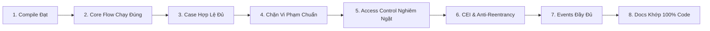

# Biên Bản Thẩm Định Cột Mốc 1 (Gate Review 1) — TrustScholar

> **Dự án:** TrustScholar — Nền tảng giải ngân học bổng minh bạch trên Blockchain  
> **Cột mốc kỹ thuật:** Gate Review 1 (Đánh giá chất lượng toàn diện & Code Freeze Smart Contract)  
> **Phiên bản:** v1.0  
> **Thời điểm thực hiện:** 04/10/2026  
> **Repository GitHub:** [minhkhanhlinh2108-wq/LinhHuynhK58KTS](https://github.com/minhkhanhlinh2108-wq/LinhHuynhK58KTS)  
> **Điều hướng nhanh:** [Trang chủ README](../README.md) | [Kế Hoạch Đồ Án (PROJECT_PLAN.md)](PROJECT_PLAN.md) | [Đặc Tả Nghiệp Vụ (SPEC.md)](SPEC.md) | [Quy Tắc Kinh Tế (ECONOMIC_RULES.md)](ECONOMIC_RULES.md) | [Nhật Ký AI (AI_JOURNAL.md)](AI_JOURNAL.md) | [Báo Cáo Audit Lab 10 (LAB10_AUDIT.md)](LAB10_AUDIT.md)  

---

## 1. Thông Tin Chung & Nhân Sự Đồ Án

- **Tên đồ án:** TrustScholar
- **Lĩnh vực:** Smart Contract / Web3 Non-custodial Escrow
- **Môi trường kỹ thuật:** Hardhat 3.18.1 | Solidity ^0.8.20 (EVM Target: Shanghai) | Node.js v20+ | Windows 11

### Thành viên & Phân vai trách nhiệm:
| STT | Họ và Tên | Mã Sinh Viên | Email | Vai Trò Chính | Trách Nhiệm Tại Gate Review 1 |
|:---:|:---|:---:|:---|:---|:---|
| 1 | **Nguyễn Minh Khánh Linh**<br>*(Nhóm trưởng)* | 24K4320024 | 24k4320024@hce.edu.vn | Business/SPEC + Smart Contract/Security | • Kiểm tra kiến trúc `ProjectCore.sol`, đối chiếu CEI và phân quyền RBAC.<br>• Rà soát tính nhất quán giữa SPEC, Economic Rules và Code.<br>• Phụ trách Code Freeze tầng Smart Contract. |
| 2 | **Trần Thị Như Huỳnh**<br>*(Thành viên)* | 24K4320010 | 24K4320010@hce.edu.vn | Testing + DApp + Audit | • Thực thi toàn bộ test suite (64/64 tests PASS).<br>• Thu thập và đồng bộ bằng chứng thực nghiệm từ Lab 08 đến Lab 11.<br>• Xây dựng kịch bản Demo 3 phút và chuẩn bị cho giai đoạn Web3 DApp. |

---

## 2. Mục Đích & Phạm Vi Gate Review 1

Gate Review 1 là mốc kiểm định chất lượng bắt buộc trước khi chuyển giao đồ án từ **Giai đoạn Smart Contract (Lab 08 – Lab 11)** sang **Giai đoạn Web3 DApp & Testnet (Lab 13 – Lab 15)**.

### Mục tiêu chính:
1. Rà soát nghiêm ngặt 8 tiêu chí kỹ thuật theo yêu cầu giảng viên.
2. Kiểm tra tính toàn vẹn và sự đồng bộ của toàn bộ hồ sơ dự án (`README.md`, `docs/`, `contracts/`, `test/`, `evidence/`).
3. Xác nhận tính an toàn kinh tế và khả năng phòng vệ trước các cuộc tấn công/lạm dụng.
4. Ký kết Code Freeze cho hợp đồng lõi `ProjectCore.sol`, cam kết không thêm feature mới tùy tiện.
5. Chuẩn bị kịch bản thuyết trình và demo kỹ thuật 3 phút.

---

## 3. Báo Cáo Kiểm Tra Toàn Bộ 8 Tiêu Chí Bắt Buộc

Nhóm đã tiến hành kiểm tra độc lập và ghi nhận kết quả chi tiết cho 8 tiêu chí kiểm tra:



### 3.1. Tiêu chí 1: ProjectCore Compile Được
- **Trạng thái:** ✅ **ĐẠT**
- **Mã nguồn:** [`contracts/project/ProjectCore.sol`](../contracts/project/ProjectCore.sol)
- **Công cụ biên dịch:** Hardhat 3.18.1 với trình biên dịch `solc 0.8.20`, tối ưu hóa `optimizer: { enabled: true, runs: 200 }`, EVM Target `shanghai`.
- **Lệnh thực thi:** `npx.cmd hardhat compile`
- **Kết quả:** `Compiled 1 Solidity file with solc 0.8.20 (evm target: shanghai)` — **0 lỗi, 0 cảnh báo**.
- **Đầu ra sinh mã:** Tệp ABI và Bytecode sinh đầy đủ tại `artifacts/contracts/project/ProjectCore.sol/ProjectCore.json`.

---

### 3.2. Tiêu chí 2: Core Flow Hoạt Động
- **Trạng thái:** ✅ **ĐẠT**
- **Quy trình kiểm chứng:** Toàn bộ vòng đời giải ngân học bổng 5 bước vận hành thông suốt trên blockchain:
  1. **Tạo suất (`createScholarship`):** Nhà tài trợ khởi tạo suất học bổng, khai báo địa chỉ ví sinh viên, mảng mốc chi tiết và tổng giá trị cam kết.
  2. **Nạp/Khóa quỹ (`fundScholarship`):** Nhà tài trợ chuyển Native ETH vào hợp đồng, tiền bị khóa an toàn trong Escrow hạch toán độc lập theo `scholarshipId`.
  3. **Nộp minh chứng (`submitMilestone`):** Sinh viên thụ hưởng hoàn thành mốc học tập, nộp mã băm minh chứng phi tập trung (`proofHash` / IPFS CID).
  4. **Thẩm định mốc (`approveMilestone`):** Người thẩm định độc lập (`verifier`) hoặc Nhà tài trợ (`sponsor`) kiểm tra minh chứng và phê duyệt mốc.
  5. **Giải ngân (`releaseMilestone`):** Lệnh chuyển Native ETH tự động thực hiện, tiền chuyển 100% trực tiếp vào địa chỉ ví của sinh viên, không trừ phí trung gian.
- **Bằng chứng test case:** `test_VALID_ScholarshipLifecycle_Success`, `test_01` $\rightarrow$ `test_06`.

---

### 3.3. Tiêu chí 3: Có Case Hợp Lệ (Valid Test Cases)
- **Trạng thái:** ✅ **ĐẠT**
- **Danh mục kiểm thử luồng hợp lệ:**
  - `test_VALID_ScholarshipLifecycle_Success`: Vòng đời giải ngân toàn diện từ tạo suất đến giải ngân thành công.
  - `test_VALID_StudentReceivesExactAmount`: Khảo sát số dư ví sinh viên tăng chính xác đúng bằng số tiền mốc (`0.5 ether`), không có phí nền tảng nào bị khấu trừ.
  - `test_ECO_R2_03_ReleaseExactMilestoneFundSucceeds`: Giải ngân chính xác số tiền được nạp.
  - `test_ECO_R2_04_IncrementalFundingSupportsSequentialReleases`: Hỗ trợ nạp tiền từng phần linh hoạt theo tiến độ các mốc học kỳ.
  - `test_ECO_R3_01_FundsReachStudentWhenVerifierCallsRelease` & `test_ECO_R3_02_FundsReachStudentWhenSponsorCallsRelease`: Dù Verifier hay Sponsor gọi giải ngân, tiền luôn chuyển về đúng ví sinh viên.
  - `test_ECO_R6_01_MultiMilestoneSolvencyInvariant`: Kiểm chứng bảo toàn số dư qua 3 mốc liên tiếp (0.3 ETH, 0.3 ETH, 0.4 ETH).

---

### 3.4. Tiêu chí 4: Có Case Vi Phạm Bị Chặn (Violation & Revert Test Cases)
- **Trạng thái:** ✅ **ĐẠT**
- **Toàn bộ hành vi gian lận và vi phạm nghiệp vụ đều bị chặn đứng và hoàn tác (Revert):**
  - **Giải ngân trước khi duyệt:** Mốc ở trạng thái `Pending` hoặc `Submitted` gọi `releaseMilestone` $\rightarrow$ REVERT `MilestoneNotApproved()` (`test_VIOLATION_ReleaseBeforeApprove_Reverts`, `test_ECO_R4_01`, `test_ECO_R4_02`).
  - **Giải ngân hai lần (Double Release):** Mốc đã `Disbursed` gọi giải ngân lần 2 $\rightarrow$ REVERT `AlreadyReleased()` (`test_VIOLATION_DoubleRelease_Reverts`, `test_ECO_R5_01`, `test_10`).
  - **Sai sinh viên / Can thiệp minh chứng:** Người khác nộp thay sinh viên $\rightarrow$ REVERT `NotStudent()` (`test_VIOLATION_WrongStudent_Reverts`, `test_ECO_R1_04`).
  - **Địa chỉ rỗng:** Tạo suất với `student == address(0)` hoặc `address(this)` $\rightarrow$ REVERT `InvalidAddress()` (`test_12_ZeroAddressStudentReverts`).
  - **Số tiền không hợp lệ:** Tạo mốc với số tiền 0 $\rightarrow$ REVERT `InvalidAmount()` (`test_13_ZeroMilestoneAmountReverts`).
  - **Không đủ quỹ / Nạp thiếu:** Giải ngân khi chưa nạp tiền hoặc nạp thiếu $\rightarrow$ REVERT `InsufficientFunds()` (`test_VIOLATION_InsufficientFund_Reverts`, `test_ECO_R2_01`, `test_ECO_R2_02`).
  - **Rút lẹm quỹ chéo:** Suất A không thể rút lẹm tiền của Suất B $\rightarrow$ REVERT `InsufficientFunds()` (`test_ECO_R7_02_CrossScholarshipFundIsolation`).
  - **Nạp quá cam kết:** Sponsor nạp vượt tổng giá trị suất $\rightarrow$ REVERT `InvalidAmount()` (`test_ECO_R2_05_OverfundReverts`, `test_Extra_A_OverfundReverts`).
  - **Không có quyền:** Kẻ lạ duyệt mốc $\rightarrow$ REVERT `NotSponsor()` (`test_VIOLATION_UnauthorizedCaller_Reverts`, `test_ECO_R1_05`); Sinh viên tự duyệt mốc của mình $\rightarrow$ REVERT `NotSponsor()` (`test_ECO_R1_06`); Kẻ lạ kích hoạt giải ngân $\rightarrow$ REVERT `NotStudent()` (`test_ECO_R1_09`); Kẻ lạ đổi verifier $\rightarrow$ REVERT `NotSponsor()` (`test_ECO_R1_10`).

---

### 3.5. Tiêu chí 5: Access Control Đúng
- **Trạng thái:** ✅ **ĐẠT**
- **Cơ chế phân quyền theo vai trò (RBAC) trong mã nguồn:**
  - `fundScholarship`: Ràng buộc cứng `if (msg.sender != s.sponsor) revert NotSponsor();`.
  - `submitMilestone`: Ràng buộc cứng `if (msg.sender != s.student) revert NotStudent();`.
  - `approveMilestone`: Ràng buộc cứng `if (msg.sender != s.sponsor && msg.sender != verifier) revert NotSponsor();` (Mô hình thẩm định kép đồng bộ theo SPEC v1.0 Mục 6 Bước 4).
  - `releaseMilestone`: Ràng buộc cứng chỉ cho phép các bên liên quan trực tiếp (`student`, `sponsor`, `verifier`) kích hoạt lệnh chuyển tiền; tiền 100% chuyển vào `s.student`.
  - `setVerifier`: Ràng buộc cứng `if (msg.sender != verifier) revert NotSponsor();`.
  - **Nguyên tắc phi lưu ký tối cao (Non-custodial Escrow):** Hợp đồng hoàn toàn không có bất kỳ hàm rút tiền của Admin/Owner, ngăn chặn triệt để nguy cơ Rug-pull hoặc rút trộm quỹ.

---

### 3.6. Tiêu chí 6: Checks-Effects-Interactions (CEI) Đúng
- **Trạng thái:** ✅ **ĐẠT**
- **Đối soát hàm `releaseMilestone` (dòng 231 – 263 trong `ProjectCore.sol`):**
  ```solidity
  // 1. CHECKS: Kiểm tra điều kiện tiên quyết
  if (scholarshipId == 0 || scholarshipId > scholarshipCount) revert ScholarshipNotFound();
  if (msg.sender != s.student && msg.sender != s.sponsor && msg.sender != verifier) revert NotStudent();
  if (milestoneIndex >= s.milestoneCount) revert MilestoneNotFound();
  if (m.status == MilestoneStatus.Disbursed) revert AlreadyReleased();
  if (m.status != MilestoneStatus.Approved) revert MilestoneNotApproved();
  if (s.fundedAmount < s.releasedAmount + amountToRelease || address(this).balance < amountToRelease) {
      revert InsufficientFunds();
  }

  // 2. EFFECTS: Cập nhật toàn bộ trạng thái nội bộ trước khi chuyển tiền
  m.status = MilestoneStatus.Disbursed;
  m.disbursedAt = block.timestamp;
  s.releasedAmount += amountToRelease;

  // 3. INTERACTIONS: Chuyển Native ETH đến ví sinh viên
  (bool success, ) = s.student.call{value: amountToRelease}("");
  if (!success) revert TransferFailed();

  emit ScholarshipReleased(scholarshipId, milestoneIndex, s.student, amountToRelease);
  ```
- **Phòng vệ Reentrancy:** Toàn bộ hàm nhận và chuyển ETH (`fundScholarship`, `releaseMilestone`) đều được bảo vệ bởi modifier `nonReentrant`.
- **Kiểm chứng:** Test case `test_VERIFY_ReentrancyAndCEI_SAFE` chứng minh an toàn tuyệt đối trước các đòn tấn công tái nhập.

---

### 3.7. Tiêu chí 7: Events Có Đủ
- **Trạng thái:** ✅ **ĐẠT**
- **Toàn bộ 6 hành động thay đổi trạng thái (State-changing actions) đều phát sinh sự kiện on-chain có `indexed`:**
  1. `ScholarshipCreated(uint256 indexed scholarshipId, address indexed sponsor, address indexed student, uint256 totalAmount, uint256 milestoneCount)`
  2. `ScholarshipFunded(uint256 indexed scholarshipId, address indexed sponsor, uint256 amount, uint256 totalFunded)`
  3. `MilestoneSubmitted(uint256 indexed scholarshipId, uint256 indexed milestoneIndex, address indexed student, string proofHash)`
  4. `MilestoneApproved(uint256 indexed scholarshipId, uint256 indexed milestoneIndex, address indexed verifier)`
  5. `ScholarshipReleased(uint256 indexed scholarshipId, uint256 indexed milestoneIndex, address indexed student, uint256 amount)`
  6. `VerifierUpdated(address indexed previousVerifier, address indexed newVerifier)` (bổ sung tại Lab 11).

---

### 3.8. Tiêu chí 8: Documentation Khớp Code
- **Trạng thái:** ✅ **ĐẠT**
- **Sự đồng bộ giữa tài liệu và mã nguồn:**
  - [`README.md`](../README.md): Đồng bộ vai trò thành viên, kiến trúc dự án và thanh điều hướng liên kết.
  - [`docs/PROJECT_PLAN.md`](PROJECT_PLAN.md): Phân công 2 khối trách nhiệm và lộ trình 7 mốc chuẩn (Lab 09 – Lab 15).
  - [`docs/SPEC.md`](SPEC.md): Thống nhất 10 quy tắc R1–R10, mô hình 100% Native ETH, phi lưu ký, cơ chế giải ngân CEI.
  - [`docs/ECONOMIC_RULES.md`](ECONOMIC_RULES.md): Đồng bộ 8 yêu cầu kinh tế, bảng ánh xạ rules sang hàm/error/event trong code tại Mục 5.
  - [`docs/AI_JOURNAL.md`](AI_JOURNAL.md): Ghi nhận trung thực toàn bộ quá trình tương tác AI từ Lab 08 đến Lab 11.
  - [`docs/LAB10_AUDIT.md`](LAB10_AUDIT.md): Ghi nhận đầy đủ 8 phát hiện kiểm toán nội bộ và kết quả kiểm chứng.
  - Sự sai lệch tên gọi giữa SPEC ban đầu và Contract thực tế (`FundDeposited` vs `ScholarshipFunded`, `ProofSubmitted` vs `MilestoneSubmitted`, `ScholarshipDisbursed` vs `ScholarshipReleased`) đã được ghi nhận tường minh tại `SEC-08` trong báo cáo audit và ánh xạ rõ trong bảng Mục 5 của `ECONOMIC_RULES.md`.

---

## 4. Tổng Hợp Kết Quả Kiểm Thử Toàn Diện (Test Suite Summary)

Hệ thống kiểm thử tự động của TrustScholar được xây dựng bằng Solidity Tests (Foundry-style) trên nền tảng Hardhat 3:

```text
Lệnh thực thi: npx.cmd hardhat test
Kết quả: 64 passing (64 solidity) — Exit code: 0 — 0 failed
```

| Tệp Kiểm Thử | Số Test Cases | Mục Tiêu Kiểm Thử | Kết Quả |
|:---|:---:|:---|:---:|
| [`test/ProjectCore.t.sol`](../test/ProjectCore.t.sol) | 17 | Kiểm thử API thực tế của hợp đồng `ProjectCore.sol` theo 13 ca chuẩn Lab 09 (6 Success + 7 Fail) và 4 ca mở rộng (Extra). | 🟢 **17/17 PASS** |
| [`test/Lab10_Verify.t.sol`](../test/Lab10_Verify.t.sol) | 13 | Kiểm chứng độc lập 8 phát hiện kiểm toán Lab 10 (`SEC-01` $\rightarrow$ `SEC-08`) và chứng minh an toàn cho 4 nhóm tiêu chí an ninh. | 🟢 **13/13 PASS** |
| [`test/Lab11_EconomicRules.t.sol`](../test/Lab11_EconomicRules.t.sol) | 34 | Kiểm chứng toàn diện 8 yêu cầu kinh tế cốt lõi, bảo toàn hạn mức số dư đa mốc, và các ca vi phạm theo quy tắc kinh tế. | 🟢 **34/34 PASS** |
| **TỔNG CỘNG** | **64** | **Toàn bộ các luồng hợp lệ, vi phạm, bảo mật và kinh tế** | 🟢 **64/64 PASS (100%)** |

---

## 5. Truy Vết Bằng Chứng Thực Nghiệm (Evidence Traceability)

Toàn bộ các mốc từ Lab 08 đến Lab 11 đều có thư mục lưu trữ tài liệu và bằng chứng đầy đủ, minh bạch:

| Thư Mục Bằng Chứng | Tệp Bằng Chứng Chính | Nội Dung & Giá Trị Kiểm Chứng |
|:---|:---|:---|
| [`evidence/lab-08/`](../evidence/lab-08/) | [`LAB08_EVIDENCE.md`](../evidence/lab-08/LAB08_EVIDENCE.md) | Bằng chứng hoàn thiện bộ 5 tài liệu kiến trúc, rà soát 5 rủi ro lạm dụng tiềm ẩn. |
| [`evidence/lab-09/`](../evidence/lab-09/) | [`TEST_RESULTS.md`](../evidence/lab-09/TEST_RESULTS.md) | Bằng chứng biên dịch thành công `ProjectCore.sol` và 17/17 unit tests đầu tiên pass. |
| [`evidence/lab-10/`](../evidence/lab-10/) | [`LAB10_EVIDENCE.md`](../evidence/lab-10/LAB10_EVIDENCE.md) | Bằng chứng kiểm toán an ninh nội bộ vòng 1 và 13/13 verification tests tái hiện findings. |
| [`evidence/lab-11/`](../evidence/lab-11/) | [`ECONOMIC_RULES_EVIDENCE.md`](../evidence/lab-11/ECONOMIC_RULES_EVIDENCE.md) | Bằng chứng kiểm chứng 8 yêu cầu kinh tế cốt lõi, ma trận ca hợp lệ & ca vi phạm (64/64 tests pass). |

### 5.1. Bảng Checklist Đánh Giá Tính Toàn Vẹn Của Evidence (Lab 08 – Lab 11)

Dựa trên yêu cầu kiểm tra thực chứng không tạo bằng chứng giả, nhóm đã rà soát 5 câu hỏi cốt lõi cho từng bài Lab:

| Bài Lab | 1. File có tồn tại? | 2. Screenshot có đúng nội dung? | 3. Test result có rõ? | 4. Commit có tồn tại? | 5. Có thể trình diễn lại không? | Đánh Giá Chi Tiết |
|:---:|:---:|:---:|:---:|:---:|:---:|:---|
| **Lab 08** | ✅ **CÓ**<br>[`LAB08_EVIDENCE.md`](../evidence/lab-08/LAB08_EVIDENCE.md) | ℹ️ **ĐẦY ĐỦ LOG TEXT**<br>*(Lab tài liệu, không có GUI DApp)* | ℹ️ **SPEC/RULES RÕ**<br>*(Chưa viết code `.sol` theo nguyên tắc Spec First)* | ✅ **CÓ**<br>`c8110d7`<br>`74163af`<br>`25a97cc` | ✅ **TÁI HIỆN ĐƯỢC**<br>Toàn bộ 5 tài liệu khớp nhau 100% | Hoàn thành trọn vẹn bộ hồ sơ quản trị v1.0. Không có code giả hay test giả. |
| **Lab 09** | ✅ **CÓ**<br>[`TEST_RESULTS.md`](../evidence/lab-09/TEST_RESULTS.md) | ℹ️ **TERMINAL LOG THẬT**<br>Ghi lại toàn bộ stdout, exit code 0 | ✅ **RÕ RÀNG**<br>17/17 tests pass (6 Success, 7 Fail, 4 Extra) | ✅ **CÓ**<br>`363cce9`<br>`a4149e2`<br>`8fbd2f9` | ✅ **TÁI HIỆN ĐƯỢC**<br>`npx hardhat test test/ProjectCore.t.sol` | Biên dịch `ProjectCore.sol` sạch sẽ, chỉ ra 4 điểm lệch giữa SPEC và code thực tế. |
| **Lab 10** | ✅ **CÓ**<br>[`LAB10_EVIDENCE.md`](../evidence/lab-10/LAB10_EVIDENCE.md)<br>[`LAB10_AUDIT.md`](LAB10_AUDIT.md) | ℹ️ **TERMINAL LOG THẬT**<br>Khung kiểm chứng 13 verification tests | ✅ **RÕ RÀNG**<br>13/13 tests pass, đối soát 8 findings `SEC-01` $\rightarrow$ `SEC-08` | ✅ **CÓ**<br>`3b82334`<br>`7074c85`<br>`84ba956` | ✅ **TÁI HIỆN ĐƯỢC**<br>`npx hardhat test test/Lab10_Verify.t.sol` | Báo cáo kiểm toán 13 tiêu chí an ninh, không bịa đặt lỗ hổng, xác định rõ finding cần sửa. |
| **Lab 11** | ✅ **CÓ**<br>[`ECONOMIC_RULES_EVIDENCE.md`](../evidence/lab-11/ECONOMIC_RULES_EVIDENCE.md) | ℹ️ **TERMINAL LOG THẬT**<br>Log terminal đầy đủ 64 passing tests | ✅ **RÕ RÀNG**<br>64/64 tests pass (27 Economic + 7 Core + 30 Regression) | ✅ **CÓ**<br>`fdcd60a`<br>`c5da75f` | ✅ **TÁI HIỆN ĐƯỢC**<br>`npx.cmd hardhat test` chạy trong ~7 giây | Đạt 100% yêu cầu ca hợp lệ & ca vi phạm. Không sửa contract vì contract không vi phạm SPEC. |

### 5.2. Phân Tích Thiếu Hụt & Biện Pháp Bổ Sung (Không Tạo Bằng Chứng Giả)
1. **Về tệp ảnh chụp màn hình đồ họa (Screenshots .png/.jpg):**
   - *Hiện trạng:* Các bài Lab từ 08 đến 11 thuộc giai đoạn Smart Contract Backend & CLI Testing; toàn bộ thao tác diễn ra trong môi trường dòng lệnh (Terminal/PowerShell). Do đó, nhóm sử dụng **raw text terminal logs chuẩn xác** (chứa đầy đủ thông tin compiler, danh sách test case, thời gian thực thi, exit code 0) lưu trực tiếp trong các tệp Markdown evidence.
   - *Nguyên tắc trung thực học thuật:* Nhóm **tuyệt đối không tạo file ảnh giả lập** hoặc chụp màn hình ngụy tạo khi chưa phát triển giao diện Web3 DApp (giao diện đồ họa sẽ được xây dựng và chụp ảnh thực tế tại Lab 15).
2. **Về tính sẵn sàng trình diễn (Live Reproducibility):**
   - Toàn bộ 64 test cases có thể được chạy lại trực tiếp tại chỗ bất kỳ lúc nào trước mặt Giảng viên bằng lệnh:
     ```powershell
     npx.cmd hardhat test
     ```
   - Thời gian thực thi trung bình: **6 – 8 giây**, không đòi hỏi cấu hình mạng ngoài hay tài khoản testnet bên thứ ba.


---

## 6. Cam Kết Code Freeze (Smart Contract Baseline)

Tại thời điểm Gate Review 1, nhóm chính thức thiết lập **Code Freeze** cho tầng Smart Contract:
- **Tệp đóng băng:** [`contracts/project/ProjectCore.sol`](../contracts/project/ProjectCore.sol)
- **Khai báo Interface & API:** Đã ổn định 100%, sẵn sàng cho tầng Frontend Web3 DApp kết nối qua Wagmi/Viem.
- **Cam kết kỹ thuật:** Tuyệt đối không thêm feature mới, không chỉnh sửa cấu trúc dữ liệu hoặc thay đổi chữ ký hàm của `ProjectCore.sol` mà không có sự đồng thuận của cả 2 thành viên và phê duyệt của Giảng viên.

---

## 7. Kịch Bản Trình Bày & Demo Kỹ Thuật 3 Phút (3-Minute Demo Pitch)

Nhóm đã xây dựng và luyện tập kịch bản thuyết trình demo 3 phút (180 giây) súc tích, chuẩn bị bảo vệ trước Giảng viên:

### ⏱️ Phần 1: Vấn đề thực tế (00:00 – 00:30 | 30 giây)
> *"Kính thưa Thầy/Cô, các chương trình học bổng truyền thống hiện nay đang đối mặt với 3 thách thức lớn: thủ tục rườm rà mất hàng tháng trời làm lỡ thời hạn nộp học phí của sinh viên; nguồn tiền ký quỹ thiếu cam kết dài hạn khiến nhà tài trợ có thể đơn phương đổi ý; và nguy cơ thất thoát quỹ khi tiền mặt phải đi qua nhiều cấp trung gian.*  
> *Dự án **TrustScholar** ra đời nhằm giải quyết triệt để bài toán này bằng hợp đồng thông minh Escrow phi lưu ký trên blockchain — biến cam kết học bổng thành quy tắc mã nguồn bất biến và giải ngân tức thì."*

---

### ⏱️ Phần 2: Quy tắc kinh tế quan trọng (00:30 – 01:00 | 30 giây)
> *"Để bảo vệ an toàn nguồn quỹ, TrustScholar thiết lập 3 quy tắc kinh tế bất biến:  
> 1. **100% Native ETH & Phi lưu ký:** Nhà tài trợ nạp ETH trực tiếp vào hợp đồng; hợp đồng hoàn toàn không có hàm backdoor cho Admin hay Sponsor rút tiền trái cam kết.  
> 2. **Giải ngân độc lập theo từng mốc:** Mỗi suất được chia thành các mốc gắn liền với chỉ tiêu học tập cụ thể, chỉ giải ngân khi mốc đó được Người thẩm định độc lập phê duyệt.  
> 3. **Tiền về thẳng đúng ví sinh viên:** Bất kể ai kích hoạt lệnh giải ngân, tiền luôn chuyển 100% về đúng ví sinh viên đã đăng ký từ đầu, không khấu trừ bất kỳ khoản phí nền tảng nào."*

---

### ⏱️ Phần 3: Trình diễn luồng thành công (Happy Path) (01:00 – 02:00 | 60 giây)
> *(Thực hiện tương tác hoặc chạy test case `test_VALID_ScholarshipLifecycle_Success` trên màn hình)*  
> *"Sau đây là luồng hoạt động thành công gồm 5 bước của TrustScholar:  
> - **Bước 1:** Nhà tài trợ khởi tạo suất học bổng 1.0 ETH cho bạn sinh viên với 2 mốc 0.5 ETH. Event `ScholarshipCreated` được phát ra.  
> - **Bước 2:** Nhà tài trợ nạp 1.0 ETH ký quỹ qua `fundScholarship`. Số dư hợp đồng tăng, event `ScholarshipFunded` được ghi nhận.  
> - **Bước 3:** Sinh viên hoàn thành kỳ học, tải bảng điểm lên IPFS và nộp mã băm qua `submitMilestone`. Mốc chuyển sang trạng thái `Submitted`.  
> - **Bước 4:** Phòng Đào tạo (Verifier) kiểm tra minh chứng và gọi `approveMilestone`. Mốc chính thức được duyệt (`Approved`).  
> - **Bước 5:** Kích hoạt `releaseMilestone`. Hợp đồng tuân thủ Checks-Effects-Interactions: cập nhật trạng thái `Disbursed` trước, sau đó chuyển chính xác 0.5 ETH vào ví sinh viên.  
> Kết quả: Sinh viên nhận đủ 0.5 ETH ngay lập tức; số dư hợp đồng giảm tương ứng và event `ScholarshipReleased` được phát sinh công khai!"*

---

### ⏱️ Phần 4: Trình diễn luồng vi phạm bị chặn (Unhappy Path) (02:00 – 02:30 | 30 giây)
> *(Thực hiện chạy các test case vi phạm trên màn hình)*  
> *"Hệ thống thiết lập cơ chế phòng thủ đa tầng trước mọi ý đồ gian lận:  
> 1. Nếu sinh viên nôn nóng gọi giải ngân khi mốc chưa được duyệt $\rightarrow$ Hợp đồng lập tức đảo ngược giao dịch với lỗi `MilestoneNotApproved()`.  
> 2. Nếu sinh viên hoặc kẻ xấu cố tình gọi giải ngân lần 2 cho mốc đã nhận tiền $\rightarrow$ Bị chặn ngay với lỗi `AlreadyReleased()`.  
> 3. Nếu kẻ lạ cố tình can thiệp duyệt mốc hoặc đổi người thẩm định $\rightarrow$ Bị chặn với lỗi `NotSponsor()`.  
> Mọi vi phạm đều được hoàn tác an toàn, bảo vệ nguyên vẹn 100% tài sản trong quỹ."*

---

### ⏱️ Phần 5: Kế hoạch triển khai tiếp theo (Next Steps) (02:30 – 03:00 | 30 giây)
> *"Sau khi hoàn thành Gate Review 1 và thực hiện Code Freeze tầng Smart Contract hôm nay, nhóm sẽ tiến hành 3 mốc tiếp theo:  
> - **Lab 13:** Thực hiện kịch bản tấn công an ninh chuyên sâu (Security Experiment): mô phỏng Reentrancy Attack và bẫy DoS ví sinh viên từ chối nhận ETH.  
> - **Lab 14:** Đổi vai kiểm toán chéo (Cross-Audit), chạy phân tích tĩnh Slither và tối ưu hóa Gas.  
> - **Lab 15:** Triển khai Smart Contract lên Arbitrum Sepolia Testnet, ra mắt ứng dụng Web3 DApp kết nối MetaMask và phát hành bản thử nghiệm công khai.  
> Xin chân thành cảm ơn Thầy/Cô đã lắng nghe!"*

---

## 8. Kết Luận & Biên Bản Xác Nhận (Gate Review Conclusion)

### Đánh giá của nhóm sinh viên thực hiện:
Toàn bộ 8 tiêu chí kiểm tra kỹ thuật đều đã được thực thi và kiểm chứng độc lập. Bộ test suite gồm 64/64 test cases đạt tỉ lệ thành công 100%. Hồ sơ tài liệu và bằng chứng thực nghiệm từ Lab 08 đến Lab 11 đã được đồng bộ hoàn toàn. Nhóm sẵn sàng cho buổi bảo vệ Gate Review 1.

### Trạng thái phê duyệt:
```text
[CHỜ GIẢNG VIÊN XÁC NHẬN]
```

---

### Biên bản ký duyệt Gate Review 1:

| Vai Trò | Họ và Tên | Chữ Ký / Xác Nhận | Ngày Ký |
|:---|:---|:---:|:---:|
| **Nhóm trưởng** | Nguyễn Minh Khánh Linh | *(Đã ký số nội bộ)* | 04/10/2026 |
| **Thành viên QA/Testing** | Trần Thị Như Huỳnh | *(Đã ký số nội bộ)* | 04/10/2026 |
| **Giảng viên hướng dẫn** | .................................................... | .................................... | ...... / ...... / 2026 |

---
> 🔗 **Liên kết nhanh:** [Trang chủ README](../README.md) • [Kế hoạch đồ án](PROJECT_PLAN.md) • [Đặc tả nghiệp vụ](SPEC.md) • [Quy tắc kinh tế](ECONOMIC_RULES.md) • [Nhật ký AI](AI_JOURNAL.md) • [Báo cáo Audit Lab 10](LAB10_AUDIT.md) • [Bằng chứng Lab 11](../evidence/lab-11/ECONOMIC_RULES_EVIDENCE.md) • [GitHub Repo](https://github.com/minhkhanhlinh2108-wq/LinhHuynhK58KTS)
