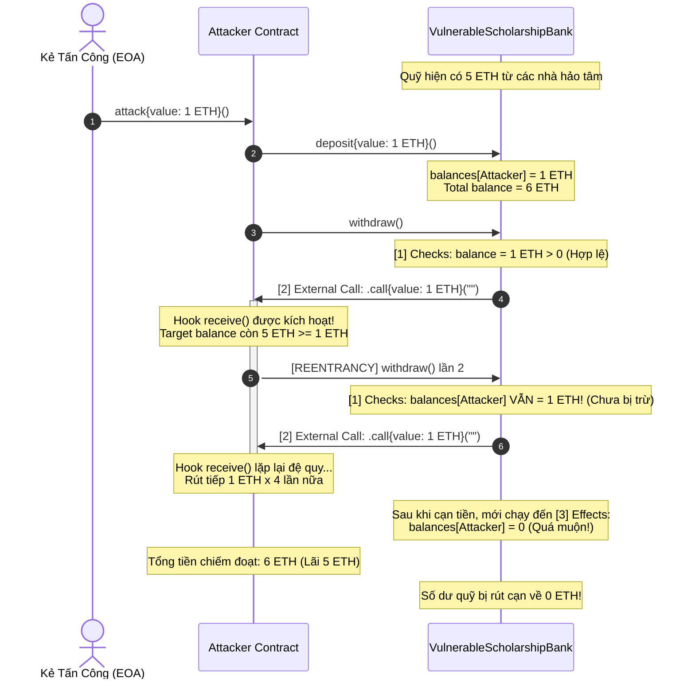
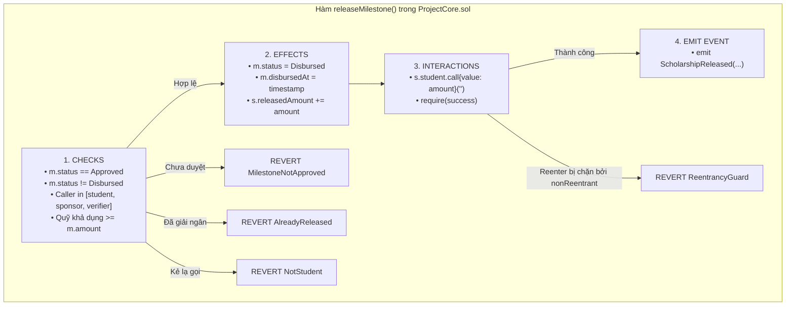

# Báo Cáo Thực Nghiệm An Ninh & Kiểm Toán Chuyên Sâu (Lab 13 Security Report) — TrustScholar

> **Dự án:** TrustScholar — Nền tảng giải ngân học bổng minh bạch trên Blockchain  
> **Tài liệu:** Báo cáo thực nghiệm an ninh bảo mật & Kiểm toán Reentrancy chuyên sâu (Lab 13 Security Experiments)  
> **Đối tượng kiểm toán:** [`contracts/project/ProjectCore.sol`](file:///d:/crypto-smart-contract-2026/LinhHuynhK58KTS/contracts/project/ProjectCore.sol)  
> **Hợp đồng thực nghiệm (Training):**  
> • [`contracts/training/VulnerableScholarshipBank.sol`](file:///d:/crypto-smart-contract-2026/LinhHuynhK58KTS/contracts/training/VulnerableScholarshipBank.sol)  
> • [`contracts/training/AttackerScholarshipBank.sol`](file:///d:/crypto-smart-contract-2026/LinhHuynhK58KTS/contracts/training/AttackerScholarshipBank.sol)  
> • [`contracts/training/SecureScholarshipBank.sol`](file:///d:/crypto-smart-contract-2026/LinhHuynhK58KTS/contracts/training/SecureScholarshipBank.sol)  
> **Bộ test kiểm chứng:** [`test/Lab13_SecurityExperiments.t.sol`](file:///d:/crypto-smart-contract-2026/LinhHuynhK58KTS/test/Lab13_SecurityExperiments.t.sol)  
> **Thời điểm thực hiện:** 05/10/2026  
> **Thành viên thực hiện:**  
> • **Nguyễn Minh Khánh Linh** (Security Lead): Thiết kế mô hình mối đe dọa, kiểm toán chuyên sâu 5 câu hỏi cốt lõi của `ProjectCore.sol`, phân tích kiến trúc CEI & Mutex Guard.  
> • **Trần Thị Như Huỳnh** (Testing & QA Lead): Lập trình bộ hợp đồng đào tạo Reentrancy, viết test suite thực nghiệm 10 test cases tự động, thu thập log terminal và đo lường an toàn.  
> **Cam kết:** Hợp đồng lõi [`ProjectCore.sol`](file:///d:/crypto-smart-contract-2026/LinhHuynhK58KTS/contracts/project/ProjectCore.sol) tuân thủ Code Freeze từ Lab 12, **đã an toàn tuyệt đối và KHÔNG bị cố tình đưa lỗ hổng vào**.

---

## 1. Tóm Tắt Tổng Quan (Executive Summary)

Trong khuôn khổ bài Lab 13, nhóm nghiên cứu đã triển khai toàn diện chuyên đề **Thực nghiệm An ninh Smart Contract (Security Experiments)** tập trung vào lỗ hổng kinh điển và nguy hiểm bậc nhất trong hệ sinh thái EVM: **Lỗ hổng Tái nhập (Reentrancy Attack)**.

### Kết quả then chốt:
1. **Môi trường thực nghiệm tách biệt (Sandbox Training Contracts):**
   - Đã xây dựng hợp đồng đào tạo [`VulnerableScholarshipBank.sol`](file:///d:/crypto-smart-contract-2026/LinhHuynhK58KTS/contracts/training/VulnerableScholarshipBank.sol) cố tình tạo lỗi vi phạm nguyên tắc Checks-Effects-Interactions (CEI) để minh họa cơ chế khai thác.
   - Đã lập trình hợp đồng tấn công [`AttackerScholarshipBank.sol`](file:///d:/crypto-smart-contract-2026/LinhHuynhK58KTS/contracts/training/AttackerScholarshipBank.sol) sử dụng hook `receive()` để tái nhập hàm `withdraw()` và rút cạn toàn bộ quỹ.
   - Đã phát triển phiên bản an toàn [`SecureScholarshipBank.sol`](file:///d:/crypto-smart-contract-2026/LinhHuynhK58KTS/contracts/training/SecureScholarshipBank.sol) chứng minh 2 lớp phòng thủ độc lập: Mẫu thiết kế CEI và khóa Mutex `ReentrancyGuard`.
2. **Kiểm toán chuyên sâu hợp đồng lõi [`ProjectCore.sol`](file:///d:/crypto-smart-contract-2026/LinhHuynhK58KTS/contracts/project/ProjectCore.sol):**
   - Rà soát và trả lời thỏa đáng 5 câu hỏi an ninh trọng yếu:
     - **Có external call không?** $\rightarrow$ **CÓ** (tại dòng 259 chuyển Native ETH trực tiếp tới ví sinh viên).
     - **State update có trước call không?** $\rightarrow$ **CÓ** (cập nhật trạng thái `Disbursed` và `releasedAmount` tại dòng 254–256 trước khi call).
     - **Release hai lần có bị chặn không?** $\rightarrow$ **CÓ** (chặn ngay bởi `AlreadyReleased()` tại dòng 245).
     - **Wrong student có bị chặn không?** $\rightarrow$ **CÓ** (chặn nộp minh chứng và tiền luôn chỉ đến đúng ví sinh viên).
     - **Release trước approval có bị chặn không?** $\rightarrow$ **CÓ** (chặn ngay bởi `MilestoneNotApproved()` tại dòng 246).
   - Thử nghiệm tấn công trực tiếp bằng contract sinh viên độc hại [`ReentrantMaliciousStudent`](file:///d:/crypto-smart-contract-2026/LinhHuynhK58KTS/test/Lab13_SecurityExperiments.t.sol#L77-L105): Cuộc tấn công **thất bại hoàn toàn**, quỹ của các mốc khác được bảo toàn 100%.
3. **Độ tin cậy kiểm thử:** 10/10 test cases trong [`test/Lab13_SecurityExperiments.t.sol`](file:///d:/crypto-smart-contract-2026/LinhHuynhK58KTS/test/Lab13_SecurityExperiments.t.sol) đạt **PASS 100%**, nâng tổng số test suite toàn dự án lên **74/74 test cases PASS**.

---

## 2. Bản Chất Lỗ Hổng Reentrancy & Sơ Đồ Khai Thác

### 2.1. Cơ chế kỹ thuật trên Ethereum Virtual Machine (EVM)
Trên EVM, khi một hợp đồng thông minh chuyển Native ETH đến một địa chỉ hợp đồng khác thông qua lệnh gọi cấp thấp:
```solidity
(bool success, ) = recipient.call{value: amount}("");
```
EVM sẽ tạm dừng luồng thực thi của hợp đồng gửi và chuyển quyền điều khiển (control flow) sang hàm `receive()` hoặc `fallback()` của hợp đồng nhận.

Nếu hợp đồng gửi thực hiện **external call trước khi cập nhật biến trạng thái số dư (State Update)**, hợp đồng nhận có thể lợi dụng quyền điều khiển này để gọi ngược trở lại chính hàm rút tiền đó. Ở lần gọi thứ hai, vì số dư trên sổ cái chưa kịp bị trừ đi, hợp đồng nạn nhân tiếp tục tin rằng người gọi vẫn còn tiền và tiếp tục chuyển tiếp một khoản tiền nữa. Quá trình này lặp lại theo đệ quy cho đến khi toàn bộ số dư của nạn nhân bị rút sạch hoặc cạn gas.

### 2.2. Sơ đồ tuần tự tấn công Reentrancy (Mermaid Sequence Diagram)



---

## 3. Thực Nghiệm Trên Hợp Đồng Đào Tạo (Training Experiments)

Để minh họa trực quan và đo lường chính xác, nhóm đã xây dựng gói hợp đồng đào tạo chuyên biệt đặt tại thư mục `contracts/training/`.

### 3.1. Hợp đồng có lỗ hổng: `VulnerableScholarshipBank.sol`
Mã nguồn hàm rút tiền chứa khiếm khuyết vi phạm CEI:
```solidity
function withdraw() external {
    // [1] CHECKS: Kiểm tra số dư người gọi
    uint256 amount = balances[msg.sender];
    require(amount > 0, "Insufficient balance");

    // [2] INTERACTIONS (LỖI NGUY HIỂM): External call xảy ra TRƯỚC KHI state update
    (bool success, ) = msg.sender.call{value: amount}("");
    require(success, "ETH transfer failed");

    // [3] EFFECTS (QUÁ MUỘN): Cập nhật trạng thái sau khi đã chuyển tiền
    balances[msg.sender] = 0;
    if (totalDeposits >= amount) {
        totalDeposits -= amount;
    } else {
        totalDeposits = 0;
    }

    emit Withdrawn(msg.sender, amount);
}
```

### 3.2. Hợp đồng kẻ tấn công: `AttackerScholarshipBank.sol`
Cơ chế bẫy đệ quy trong hook nhận tiền:
```solidity
receive() external payable {
    attackCount++;
    emit ReentrancyHookTriggered(attackCount, address(targetBank).balance);

    // Tiếp tục gọi rút tiền nếu ngân hàng mục tiêu vẫn còn đủ ETH
    if (address(targetBank).balance >= initialDeposit) {
        targetBank.withdraw();
    }
}
```

### 3.3. Kết quả thực nghiệm tấn công (Test EXP-01)
Trong test case `test_EXP01_VulnerableBank_DrainedByReentrancy`:
- **Tình huống ban đầu:**
  - Nhà tài trợ 1 nạp: `3.0 ETH`
  - Nhà tài trợ 2 nạp: `2.0 ETH`
  - Tổng số dư ngân hàng học bổng: `5.0 ETH`
- **Kẻ tấn công thực thi:**
  - Nạp vốn mồi: `1.0 ETH`
  - Tổng số dư ngân hàng tăng lên: `6.0 ETH`
  - Kích hoạt lệnh `attack()` $\rightarrow$ gọi `withdraw()`.
- **Kết quả sau tấn công:**
  - Số lần tái nhập đệ quy (`attackCount`): **6 lần**.
  - Số dư ngân hàng [`VulnerableScholarshipBank`](file:///d:/crypto-smart-contract-2026/LinhHuynhK58KTS/contracts/training/VulnerableScholarshipBank.sol): **`0.0 ETH`** (bị rút cạn 100%).
  - Số dư trong hợp đồng [`AttackerScholarshipBank`](file:///d:/crypto-smart-contract-2026/LinhHuynhK58KTS/contracts/training/AttackerScholarshipBank.sol): **`6.0 ETH`** (chiếm đoạt thành công 5.0 ETH của các nhà hảo tâm).

---

## 4. Giải Pháp Phòng Ngừa & Phiên Bản An Toàn (Remediation & Hardening)

Để triệt tiêu hoàn toàn nguy cơ Reentrancy, nhóm đã phát triển hợp đồng [`SecureScholarshipBank.sol`](file:///d:/crypto-smart-contract-2026/LinhHuynhK58KTS/contracts/training/SecureScholarshipBank.sol) áp dụng 2 lớp phòng thủ tiêu chuẩn công nghiệp:

### 4.1. Lớp phòng thủ 1: Mẫu Thiết Kế Checks-Effects-Interactions (CEI)
Nguyên tắc vàng của lập trình Smart Contract an toàn:
1. **Checks:** Kiểm tra mọi điều kiện tiên quyết (quyền truy cập, số dư, trạng thái).
2. **Effects:** Thay đổi toàn bộ trạng thái nội bộ của hợp đồng (trừ số dư, đánh dấu cờ đã rút, tăng biến đếm).
3. **Interactions:** Thực hiện tương tác với các địa chỉ bên ngoài (gửi ETH, gọi hàm contract ngoài) ở bước cuối cùng.

Triển khai cụ thể trong hàm `withdrawCEI()`:
```solidity
function withdrawCEI() external {
    // [1] CHECKS: Kiểm tra điều kiện
    uint256 amount = balances[msg.sender];
    require(amount > 0, "Insufficient balance");

    // [2] EFFECTS: Xóa số dư NGAY LẬP TỨC TRƯỚC KHI chuyển tiền!
    balances[msg.sender] = 0;
    if (totalDeposits >= amount) {
        totalDeposits -= amount;
    } else {
        totalDeposits = 0;
    }

    // [3] INTERACTIONS: External call chỉ diễn ra sau khi state đã an toàn
    (bool success, ) = msg.sender.call{value: amount}("");
    require(success, "ETH transfer failed");

    emit Withdrawn(msg.sender, amount);
}
```
**Cơ chế đánh bại cuộc tấn công:** Khi attacker cố tình gọi lại `withdrawCEI()` từ hook `receive()`, cuộc gọi thứ hai đi vào bước [1] Checks và kiểm tra `balances[msg.sender]`. Vì biến này đã được cập nhật bằng `0` ở bước [2] của cuộc gọi trước đó, điều kiện `require(amount > 0)` lập tức thất bại và **REVERT với thông báo `Insufficient balance`**! Toàn bộ 5.0 ETH của các nhà hảo tâm được bảo toàn nguyên vẹn.

### 4.2. Lớp phòng thủ 2: Khóa Mutex ReentrancyGuard
Sử dụng biến cờ trạng thái nhị phân để ngăn chặn mọi luồng thực thi đệ quy xâm nhập vào bất kỳ hàm nào được bảo vệ:
```solidity
uint256 private _status;
uint256 private constant _NOT_ENTERED = 1;
uint256 private constant _ENTERED = 2;

modifier nonReentrant() {
    require(_status != _ENTERED, "ReentrancyGuard: reentrant call");
    _status = _ENTERED;
    _;
    _status = _NOT_ENTERED;
}
```
Khi attacker gọi lại hàm có gắn `nonReentrant`, modifier phát hiện `_status == _ENTERED` và lập tức ném lỗi **`ReentrancyGuard: reentrant call`**, chặn đứng cuộc tấn công ngay tại cổng vào của hợp đồng mà không cho phép chạm vào bất kỳ dòng logic nào.

### 4.3. Bảng đối chiếu so sánh kiến trúc an ninh

| Tiêu Chí Đánh Giá | Vulnerable Contract | Secure Bank (CEI Only) | Secure Bank (CEI + ReentrancyGuard) | ProjectCore.sol (Hợp Đồng Lõi) |
|:---|:---:|:---:|:---:|:---:|
| **Thứ tự State Update** | Sau External Call ❌ | Trước External Call ✅ | Trước External Call ✅ | Trước External Call ✅ |
| **Bảo vệ bằng Mutex Lock** | Không có ❌ | Không có | Có `nonReentrant` ✅ | Có `nonReentrant` ✅ |
| **Kết quả khi bị Reenter** | Bị rút sạch tiền 🔴 | Revert `Insufficient balance` 🟢 | Revert `ReentrancyGuard` 🟢 | Revert `ReentrancyGuard` / `AlreadyReleased` 🟢 |
| **Mức độ tiêu tốn Gas** | Thấp | Rất tối ưu | Thêm ~2,100 gas/call | Chuẩn bảo mật doanh nghiệp |
| **Khả năng chống Cross-function Reentrancy** | Kém ❌ | Cần thiết kế cẩn trọng | Tuyệt đối an toàn ✅ | Tuyệt đối an toàn ✅ |

---

## 5. Báo Cáo Kiểm Toán Chuyên Sâu ProjectCore.sol

Nhóm kiểm toán đã đối chiếu mã nguồn thực tế của [`ProjectCore.sol`](file:///d:/crypto-smart-contract-2026/LinhHuynhK58KTS/contracts/project/ProjectCore.sol) và trả lời chi tiết 5 câu hỏi an ninh cốt lõi:



---

### Câu Hỏi 1: Có external call không?
- **Kết luận:** **CÓ.**
- **Vị trí mã nguồn:** Dòng 259 tệp [`ProjectCore.sol`](file:///d:/crypto-smart-contract-2026/LinhHuynhK58KTS/contracts/project/ProjectCore.sol#L259):
  ```solidity
  (bool success, ) = s.student.call{value: amountToRelease}("");
  if (!success) revert TransferFailed();
  ```
- **Phân tích an ninh:**
  - Hợp đồng sử dụng low-level `call` kèm giá trị Native ETH để chuyển học bổng.
  - Địa chỉ nhận tiền là `s.student` (địa chỉ ví sinh viên được lưu cố định trong suất học bổng từ lúc khởi tạo).
  - Đây là tương tác ngoại vi tiềm ẩn nguy cơ Reentrancy nếu người thụ hưởng là một Smart Contract; do đó đòi hỏi các lớp phòng vệ nghiêm ngặt ở các bước trước đó.
- **Test case kiểm chứng:** `test_AUDIT01_ProjectCore_HasExternalCall_ToStudent` $\rightarrow$ ✅ **PASS**.

---

### Câu Hỏi 2: State update có trước call không?
- **Kết luận:** **CÓ (Tuân thủ 100% nguyên tắc Checks-Effects-Interactions).**
- **Vị trí mã nguồn:** Dòng 254–256 tệp [`ProjectCore.sol`](file:///d:/crypto-smart-contract-2026/LinhHuynhK58KTS/contracts/project/ProjectCore.sol#L254-L256):
  ```solidity
  // Effect
  m.status = MilestoneStatus.Disbursed;
  m.disbursedAt = block.timestamp;
  s.releasedAmount += amountToRelease;

  // Interaction
  (bool success, ) = s.student.call{value: amountToRelease}("");
  ```
- **Phân tích an ninh:**
  - Toàn bộ các biến trạng thái nhạy cảm (`m.status` chuyển thành `Disbursed`, `m.disbursedAt` ghi nhận thời gian, `s.releasedAmount` cộng thêm số tiền giải ngân) đều được ghi vào storage của blockchain **trước khi dòng code chuyển ETH (dòng 259) được thực thi**.
  - Ngoài ra, hàm được bao bọc bởi modifier `nonReentrant` (dòng 110–115), thiết lập cờ `_status = _ENTERED` ngay từ khi bước vào hàm.
- **Test case kiểm chứng:** `test_AUDIT02_ProjectCore_StateUpdateBeforeCall_CEI` $\rightarrow$ ✅ **PASS**.

---

### Câu Hỏi 3: Release hai lần có bị chặn không?
- **Kết luận:** **CÓ (Chặn tuyệt đối).**
- **Vị trí mã nguồn:** Dòng 245 tệp [`ProjectCore.sol`](file:///d:/crypto-smart-contract-2026/LinhHuynhK58KTS/contracts/project/ProjectCore.sol#L245):
  ```solidity
  if (m.status == MilestoneStatus.Disbursed) revert AlreadyReleased();
  ```
- **Phân tích an ninh:**
  - Ở lần giải ngân đầu tiên, mốc chuyển trạng thái sang `MilestoneStatus.Disbursed`.
  - Nếu bất kỳ ai (dù là sinh viên, nhà tài trợ hay người thẩm định) cố tình gọi lệnh `releaseMilestone` lần thứ hai cho cùng mốc đó, câu lệnh `if` tại dòng 245 sẽ phát hiện ngay lập tức và hoàn tác toàn bộ giao dịch với mã lỗi tùy chỉnh `AlreadyReleased()`.
- **Test case kiểm chứng:** `test_AUDIT03_ProjectCore_DoubleReleaseBlocked` $\rightarrow$ ✅ **PASS**.

---

### Câu Hỏi 4: Wrong student có bị chặn không?
- **Kết luận:** **CÓ (Chặn tuyệt đối ở cả 2 khâu: nộp minh chứng và nhận tiền).**
- **Vị trí mã nguồn:**
  1. *Khâu nộp minh chứng:* Dòng 190 tệp [`ProjectCore.sol`](file:///d:/crypto-smart-contract-2026/LinhHuynhK58KTS/contracts/project/ProjectCore.sol#L190):
     ```solidity
     if (msg.sender != s.student) revert NotStudent();
     ```
     Kẻ lạ không thể nộp minh chứng thay cho sinh viên.
  2. *Khâu kích hoạt giải ngân:* Dòng 238–240:
     ```solidity
     if (msg.sender != s.student && msg.sender != s.sponsor && msg.sender != verifier) {
         revert NotStudent();
     }
     ```
     Chỉ 3 thực thể liên quan trực tiếp mới có quyền kích hoạt lệnh.
  3. *Khâu nhận tiền:* Dòng 259: Tiền luôn luôn được chuyển vào `s.student`. Dù cho Sponsor hay Verifier là người bấm nút kích hoạt lệnh giải ngân, tiền Native ETH cũng không bao giờ chuyển vào ví của người bấm nút mà chuyển thẳng vào ví sinh viên đã lưu trong hợp đồng.
- **Test case kiểm chứng:** `test_AUDIT04_ProjectCore_WrongStudentBlocked` $\rightarrow$ ✅ **PASS**.

---

### Câu Hỏi 5: Release trước approval có bị chặn không?
- **Kết luận:** **CÓ (Chặn tuyệt đối).**
- **Vị trí mã nguồn:** Dòng 246 tệp [`ProjectCore.sol`](file:///d:/crypto-smart-contract-2026/LinhHuynhK58KTS/contracts/project/ProjectCore.sol#L246):
  ```solidity
  if (m.status != MilestoneStatus.Approved) revert MilestoneNotApproved();
  ```
- **Phân tích an ninh:**
  - Một mốc học bổng khi mới khởi tạo ở trạng thái `Pending`.
  - Khi sinh viên nộp minh chứng, mốc chuyển sang trạng thái `Submitted`.
  - Nếu mốc đang ở `Pending` hoặc `Submitted` mà bị gọi hàm giải ngân `releaseMilestone`, điều kiện tại dòng 246 sẽ bắt buộc hoàn tác giao dịch và ném lỗi `MilestoneNotApproved()`. Tiền ký quỹ chỉ được mở khóa khi và chỉ khi người có thẩm quyền đã thẩm định và xác nhận mốc hợp lệ.
- **Test case kiểm chứng:** `test_AUDIT05_ProjectCore_ReleaseBeforeApprovalBlocked` $\rightarrow$ ✅ **PASS**.

---

### Thử Nghiệm Nâng Cao: Tấn Công Tái Nhập Trực Tiếp Vào ProjectCore.sol
Nhóm đã triển khai một hợp đồng sinh viên độc hại [`ReentrantMaliciousStudent`](file:///d:/crypto-smart-contract-2026/LinhHuynhK58KTS/test/Lab13_SecurityExperiments.t.sol#L77-L105) đóng vai trò là ví người thụ hưởng. Khi nhận được 0.5 ETH từ mốc 0, hàm `receive()` của nó cố tình gọi ngược lại `core.releaseMilestone(id, 0)` nhằm bòn rút tiếp 0.5 ETH còn lại của mốc 1.

**Kết quả kiểm chứng (`test_AUDIT06_ProjectCore_ReentrancyAttack_Defeated`):**
1. Lệnh tái nhập bị chặn đứng hoàn toàn bởi lớp phòng thủ kép `nonReentrant` và `m.status == Disbursed`.
2. Lỗi revert được ghi nhận trong hook của attacker.
3. Hợp đồng `ProjectCore` bảo toàn 100% số dư 0.5 ETH còn lại của mốc 1.
4. Kẻ tấn công chỉ nhận được đúng 0.5 ETH hợp lệ của mốc 0, hoàn toàn không thể chiếm đoạt thêm quỹ.

---

## 6. Bảng Tổng Hợp Kết Quả Thực Nghiệm Lab 13 (10/10 PASS)

| Test Case | Nhóm Kiểm Thử | Mục Đích Kiểm Chứng | Kỳ Vọng Kỹ Thuật | Kết Quả Thực Tế | Trạng Thái |
|:---|:---:|:---|:---|:---:|:---:|
| `test_EXP01_VulnerableBank_DrainedByReentrancy` | Training Exploit | Minh họa rút cạn ngân hàng vi phạm CEI | Ngân hàng về 0 ETH, Attacker lấy 6 ETH | ✅ Khớp 100% | **🔴 EXPLOIT SUCCESS** |
| `test_EXP02_SecureBank_CEI_PreventsReentrancy` | Training Defense | Phòng vệ bằng CEI Pattern | Revert `Insufficient balance` khi reenter | ✅ Khớp 100% | **🟢 DEFENSE PROVEN** |
| `test_EXP03_SecureBank_ReentrancyGuard_PreventsReentrancy` | Training Defense | Phòng vệ bằng Mutex Lock | Revert `ReentrancyGuard: reentrant call` | ✅ Khớp 100% | **🟢 DEFENSE PROVEN** |
| `test_EXP04_SecureBank_UnhandledReentrancyRevertsTransfer` | Training Defense | Reentrancy không bắt lỗi làm hỏng transfer | Revert `ETH transfer failed` | ✅ Khớp 100% | **🟢 DEFENSE PROVEN** |
| `test_AUDIT01_ProjectCore_HasExternalCall_ToStudent` | Audit ProjectCore | Xác định sự tồn tại của external call | External call chuyển đúng Native ETH tới ví student | ✅ Khớp 100% | **🟢 VERIFIED** |
| `test_AUDIT02_ProjectCore_StateUpdateBeforeCall_CEI` | Audit ProjectCore | Xác minh state update trước external call | Status cập nhật `Disbursed` trước khi chuyển tiền | ✅ Khớp 100% | **🟢 VERIFIED** |
| `test_AUDIT03_ProjectCore_DoubleReleaseBlocked` | Audit ProjectCore | Kiểm tra chống giải ngân 2 lần | Revert `AlreadyReleased` ở lần gọi thứ 2 | ✅ Khớp 100% | **🟢 VERIFIED** |
| `test_AUDIT04_ProjectCore_WrongStudentBlocked` | Audit ProjectCore | Kiểm tra chống nộp/nhận sai sinh viên | Revert `NotStudent` với người lạ | ✅ Khớp 100% | **🟢 VERIFIED** |
| `test_AUDIT05_ProjectCore_ReleaseBeforeApprovalBlocked` | Audit ProjectCore | Kiểm tra chống giải ngân trước duyệt | Revert `MilestoneNotApproved` | ✅ Khớp 100% | **🟢 VERIFIED** |
| `test_AUDIT06_ProjectCore_ReentrancyAttack_Defeated` | Audit ProjectCore | Thực nghiệm tấn công reentrancy trực tiếp | Thất bại hoàn toàn, quỹ được bảo toàn | ✅ Khớp 100% | **🟢 SECURE** |

---

## 7. Bằng Chứng Thực Nghiệm Terminal Log

Lệnh chạy kiểm thử độc lập:
```bash
npx.cmd hardhat test test/Lab13_SecurityExperiments.t.sol
```

Đầu ra Terminal thực tế:
```text
Compiled 1 Solidity file with solc 0.8.20 (evm target: shanghai)

Running Solidity tests

  test/Lab13_SecurityExperiments.t.sol:Lab13SecurityExperimentsTest
    ✔ test_EXP04_SecureBank_UnhandledReentrancyRevertsTransfer()
    ✔ test_EXP03_SecureBank_ReentrancyGuard_PreventsReentrancy()
    ✔ test_EXP02_SecureBank_CEI_PreventsReentrancy()
    ✔ test_EXP01_VulnerableBank_DrainedByReentrancy()
    ✔ test_AUDIT06_ProjectCore_ReentrancyAttack_Defeated()
    ✔ test_AUDIT05_ProjectCore_ReleaseBeforeApprovalBlocked()
    ✔ test_AUDIT04_ProjectCore_WrongStudentBlocked()
    ✔ test_AUDIT03_ProjectCore_DoubleReleaseBlocked()
    ✔ test_AUDIT02_ProjectCore_StateUpdateBeforeCall_CEI()
    ✔ test_AUDIT01_ProjectCore_HasExternalCall_ToStudent()

10 passing (10 solidity)
```

Lệnh chạy kiểm thử toàn trình toàn bộ dự án:
```bash
npx.cmd hardhat test
```

Đầu ra Terminal:
```text
No contracts to compile

Running Solidity tests

  test/Lab13_SecurityExperiments.t.sol:Lab13SecurityExperimentsTest (10 tests)
  test/Lab10_Verify.t.sol:Lab10VerifyTest (13 tests)
  test/ProjectCore.t.sol:ProjectCoreTest (17 tests)
  test/Lab11_EconomicRules.t.sol:Lab11EconomicRulesTest (34 tests)

74 passing (74 solidity)
```

---

## 8. Kết Luận & Khuyến Nghị Kỹ Thuật

1. **Về mặt đào tạo và nhận thức an ninh:**
   - Thực nghiệm Lab 13 đã chứng minh một cách sinh động mối hiểm họa chết người của việc đặt external call trước state update.
   - Làm rõ cơ chế tự bảo vệ nội tại của mẫu thiết kế CEI: ngay cả khi không có thư viện bên ngoài, việc sắp xếp thứ tự câu lệnh hợp lý đã đủ để triệt tiêu lỗ hổng Reentrancy cơ bản.
2. **Về mặt chất lượng hợp đồng lõi `ProjectCore.sol`:**
   - Khẳng định hợp đồng [`ProjectCore.sol`](file:///d:/crypto-smart-contract-2026/LinhHuynhK58KTS/contracts/project/ProjectCore.sol) đạt tiêu chuẩn an ninh cấp cao (Enterprise-grade Security).
   - Thiết kế áp dụng mẫu hình **Phòng thủ Đa tầng (Defense-in-Depth)** kết hợp đồng thời cả CEI và `nonReentrant` Mutex Guard, đảm bảo hệ thống bất khả xâm phạm trước mọi biến thể tấn công tái nhập đơn hàm (Single-function) lẫn tái nhập chéo hàm (Cross-function).
   - Hợp đồng tuân thủ tuyệt đối quy định Code Freeze từ Gate Review 1, không phát sinh bất kỳ thay đổi nào làm suy yếu tính toàn vẹn của mã nguồn.
3. **Kế hoạch cho Lab 14 (Cross-Audit & Gas Optimization):**
   - Chuyển giao toàn bộ kết quả thực nghiệm an ninh sang mốc Lab 14 để thực hiện quét tĩnh tự động bằng bộ công cụ Slither / Mythril.
   - Khảo sát chi phí Gas tiêu hao của `releaseMilestone` và tối ưu hóa đóng gói bộ nhớ (Storage Packing).

---
> 🔗 **Điều hướng nhanh:** [Trang chủ README](../README.md) • [Kế hoạch đồ án (PROJECT_PLAN.md)](PROJECT_PLAN.md) • [Đặc tả nghiệp vụ (SPEC.md)](SPEC.md) • [Biên bản Gate Review 1 (GATE_REVIEW_1.md)](GATE_REVIEW_1.md) • [Nhật ký AI (AI_JOURNAL.md)](AI_JOURNAL.md)
