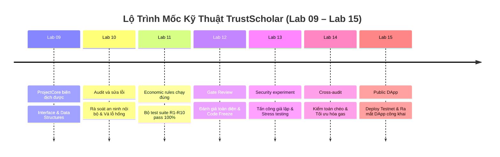

# Kế Hoạch Đồ Án (Project Plan) - TrustScholar

> **Dự án:** TrustScholar — Nền tảng giải ngân học bổng minh bạch trên Blockchain  
> **Phiên bản:** v1.0 (Kế hoạch phân vai & Lộ trình thực hiện Lab 08 – Lab 15)  
> **Repository GitHub:** [minhkhanhlinh2108-wq/LinhHuynhK58KTS](https://github.com/minhkhanhlinh2108-wq/LinhHuynhK58KTS)  
> **Điều hướng nhanh:** [Trang chủ README](../README.md) | [Đặc Tả Nghiệp Vụ (SPEC.md)](SPEC.md) | [Quy Tắc Kinh Tế (ECONOMIC_RULES.md)](ECONOMIC_RULES.md) | [Nhật Ký AI (AI_JOURNAL.md)](AI_JOURNAL.md)  
> **Mục tiêu:** Nền tảng giải ngân học bổng minh bạch, phi tập trung và chống gian lận trên Blockchain.

---

## 1. Thành Viên & Phân Vai Trách Nhiệm (Team Members & Role Allocation)

Dự án **TrustScholar** được phát triển bởi nhóm **02 thành viên**, phân chia trách nhiệm chuyên môn hóa sâu theo 2 khối kỹ thuật cốt lõi:

| STT | Thành Viên | Mã Sinh Viên | Khối Trách Nhiệm Chuyên Môn | Nhiệm Vụ Cụ Thể |
|:---:|:---|:---:|:---|:---|
| 1 | **Nguyễn Minh Khánh Linh** *(Nhóm trưởng)* | 24K4320024 | **Business/SPEC + Smart Contract/Security** | • Chủ trì phân tích nghiệp vụ, mô hình dữ liệu và cập nhật tài liệu đặc tả [SPEC.md](SPEC.md), [ECONOMIC_RULES.md](ECONOMIC_RULES.md). • Trực tiếp thiết kế kiến trúc và lập trình mã nguồn Smart Contract lõi (`ProjectCore.sol`, Escrow logic, RBAC). • Thiết lập các cơ chế phòng vệ an ninh on-chain (Checks-Effects-Interactions, `ReentrancyGuard`, ngăn chặn rút quá quỹ, bẫy DoS). • Phân tích mô hình mối đe dọa (Threat Modeling) và xử lý các lỗi bảo mật phát hiện trong quá trình phát triển. |
| 2 | **Trần Thị Như Huỳnh** *(Thành viên)* | 24K4320010 | **Testing + DApp + Audit** | • Xây dựng hệ thống kiểm thử tự động (Unit Test, Fuzz Testing, Edge Case Testing cho toàn bộ quy tắc R1–R10). • Thiết kế và lập trình giao diện người dùng Web3 DApp (React/Vite, kết nối ví MetaMask/WalletConnect qua Wagmi/Viem). • Thực hiện kiểm toán độc lập (Audit), chạy công cụ phân tích tĩnh (Slither) và thực nghiệm bảo mật (Security Experiments). • Phụ trách kiểm thử toàn trình (E2E Integration Test), tối ưu chi phí Gas và triển khai (Deploy) công khai lên Testnet/Web hosting. |

---

## 2. Người Dùng Và Vấn Đề Giải Quyết (Problem & Target Users)

### 2.1. Đối Tượng Sử Dụng Mục Tiêu
1. **Nhà tài trợ (Sponsors / Donors):**
   - Các doanh nghiệp, tổ chức phi chính phủ, quỹ thiện nguyện cá nhân hoặc cựu sinh viên.
   - **Mục tiêu:** Ký quỹ ETH minh bạch, theo dõi tiến độ giải ngân từng mốc, đảm bảo tiền chuyển trực tiếp đến đúng sinh viên mà không bị thất thoát qua khâu trung gian.
2. **Sinh viên thụ hưởng (Students / Beneficiaries):**
   - Sinh viên vượt khó, sinh viên có thành tích học tập và nghiên cứu xuất sắc được tuyển chọn nhận học bổng.
   - **Mục tiêu:** Nộp minh chứng hoàn thành mốc học tập minh bạch, nhận tiền giải ngân nhanh chóng, đúng hạn và đúng số tiền cam kết về ví cá nhân.
3. **Người thẩm định / Xác thực (Verifiers / Evaluators):**
   - Đại diện Phòng Đào tạo, Phòng Công tác sinh viên hoặc Hội đồng chuyên môn của Nhà tài trợ.
   - **Mục tiêu:** Thẩm định tính xác thực của minh chứng ngoại tuyến và phê duyệt mốc on-chain mà không cần xử lý tiền mặt thủ công.
4. **Cộng đồng & Kiểm toán viên (Public Observers):**
   - Giám sát toàn bộ dòng tiền và trạng thái giải ngân công khai theo thời gian thực trên blockchain.

### 2.2. Vấn Đề Cần Giải Quyết
- **Thủ tục rườm rà & Chậm giải ngân:** Quy trình giải ngân truyền thống qua nhiều tầng trung gian mất từ vài tuần đến vài tháng, làm ảnh hưởng đến thời hạn nộp học phí của sinh viên.
- **Rủi ro thất thoát & Phê duyệt cảm tính:** Tiền mặt gửi qua tài khoản trung gian thiếu cơ chế kiểm toán tức thời, tiềm ẩn nguy cơ cấp sai đối tượng.
- **Thiếu cam kết quỹ dài hạn:** Sinh viên nỗ lực hoàn thành học kỳ nhưng có nguy cơ không nhận được tiền nếu nhà tài trợ đổi ý hoặc quỹ bị phân bổ sai mục đích.

---

## 3. Lộ Trình Phát Triển Mốc Bắt Buộc (Milestones Lab 09 – Lab 15)

Dự án bám sát 7 mốc triển khai kỹ thuật tuần tự, đảm bảo mỗi bài Lab đều có đầu ra rõ ràng và được kiểm chứng nghiêm ngặt:

### Bảng Chi Tiết Mốc Triển Khai:

| Mốc | Tên Mốc Chuẩn | Trách Nhiệm Chính | Mục Tiêu & Nội Dung Triển Khai | Tiêu Chí Nghiệm Thu (Acceptance Criteria) |
|:---:|:---|:---:|:---|:---|
| **Lab 09** | **ProjectCore biên dịch được** | **Khánh Linh** *(Chủ trì)* Như Huỳnh *(Phối hợp)* | • Định nghĩa Interface (`IScholarshipPool`, `IScholarshipVerifier`). • Xây dựng cấu trúc dữ liệu (`struct Scholarship`, `struct Milestone`, `enum MilestoneStatus`). • Lập trình khung xương hợp đồng `ProjectCore.sol` gồm khai báo State Variables, Mappings, Custom Errors và Events. • Thiết lập môi trường dự án (Foundry/Hardhat). | • Lệnh biên dịch (`forge build` hoặc `npx hardhat compile`) thành công 100%, 0 warning nghiêm trọng. • Tệp ABI và bytecode được tạo thành công. |
| **Lab 10** | **Audit và sửa lỗi** | **Như Huỳnh** *(Audit)* **Khánh Linh** *(Sửa lỗi)* | • Rà soát an ninh mã nguồn nội bộ vòng 1. • Kiểm tra phân quyền truy cập (`AccessControl`), bẫy địa chỉ rỗng (`address(0)`), và mẫu Checks-Effects-Interactions (CEI). • Tích hợp khóa chống tái nhập (`ReentrancyGuard`) cho các hàm dòng tiền. • Khắc phục triệt để các cảnh báo bảo mật được chỉ ra. | • Báo cáo Internal Audit v1 ghi nhận toàn bộ điểm nghi vấn. • Mã nguồn được cập nhật, vá hết các lỗ hổng tìm thấy. |
| **Lab 11** | **Economic rules chạy đúng** | **Như Huỳnh** *(Viết test)* **Khánh Linh** *(Hỗ trợ)* | • Viết bộ Unit Test và Integration Test tự động kiểm chứng toàn bộ quy tắc kinh tế trong [ECONOMIC_RULES.md](ECONOMIC_RULES.md) và bộ quy tắc R1–R10 trong [SPEC.md](SPEC.md). • Kiểm thử các điều kiện biên: nạp ETH testnet, khóa theo suất, sinh viên nhận tiền đúng điều kiện, tiền về đúng ví, chống giải ngân 2 lần, chống giải ngân vượt quỹ, phân quyền verifier. | • 100% test cases pass màu xanh. • Test coverage đạt trên 90% cho logic giải ngân cốt lõi. |
| **Lab 12** | **Gate Review** | **Khánh Linh & Như Huỳnh** *(Đồng chủ trì)* | • Tổ chức phiên thẩm định chất lượng toàn diện (Milestone Gate Review). • Đánh giá chéo sự ăn khớp giữa SPEC, Economic Rules và Smart Contract. • Phân tích mô hình mối đe dọa (Threat Model) và rà soát các giả định bảo mật. • Thực hiện "Code Freeze" tầng hợp đồng thông minh để chuẩn bị cho giai đoạn DApp & Testnet. | • Biên bản Gate Review có chữ ký xác nhận của 2 thành viên. • Danh mục nghiệm thu (Go/No-Go Checklist) đạt chuẩn để chuyển giai đoạn. |
| **Lab 13** | **Security experiment** | **Như Huỳnh** *(Thực nghiệm)* **Khánh Linh** *(Bảo mật)* | • Xây dựng các kịch bản tấn công giả lập on-chain (Security Experiments): Thử nghiệm Reentrancy Attack bằng contract độc hại, thử nghiệm Denial of Service (DoS) khi ví sinh viên là contract revert, thử nghiệm Front-running khi nạp/rút quỹ. • Đo lường khả năng chống chịu của hệ thống trước hành vi người dùng thận trọng / kẻ tấn công. | • Báo cáo thực nghiệm an ninh (Security Experiment Report) chi tiết kèm bằng chứng PoC (Proof of Concept). • Các cơ chế phòng vệ (Pull pattern, Timelock) được kiểm chứng hiệu quả. |
| **Lab 14** | **Cross-audit** | **Khánh Linh & Như Huỳnh** *(Kiểm toán chéo)* | • Hai thành viên đổi vai kiểm toán độc lập mã nguồn và giao diện. • Chạy công cụ phân tích tĩnh chuyên sâu (Slither, Mythril) để phát hiện lỗ hổng tiềm ẩn. • Bật `hardhat-gas-reporter` / `forge snapshot` để phân tích chi phí gas và thực hiện tối ưu hóa cấu trúc lưu trữ (Storage packing). • Kiểm thử toàn trình (E2E Integration Test) giữa hợp đồng và Web3 provider. | • Báo cáo Cross-Audit Report hoàn chỉnh. • Bảng đối chuẩn chi phí Gas trước và sau khi tối ưu hóa. |
| **Lab 15** | **Public DApp** | **Như Huỳnh** *(Frontend & Deploy)* **Khánh Linh** *(Docs & Demo)* | • Triển khai (Deploy) hợp đồng lên mạng thử nghiệm công khai (Sepolia / Arbitrum Sepolia Testnet). • Verify mã nguồn công khai trên Etherscan. • Đóng gói và phát hành ứng dụng Frontend Web3 DApp hoàn chỉnh lên hosting công cộng (Vercel/Netlify). • Thực hiện đầy đủ luồng tương tác thực tế bằng ví MetaMask (Tạo suất, Nạp ETH testnet, Nộp minh chứng, Duyệt mốc, Giải ngân). • Hoàn thiện bộ slide thuyết trình, video demo và nghiệm thu đồ án. | • Smart Contract đã verify trên Testnet Explorer. • Live DApp URL hoạt động ổn định và kết nối ví thành công. • Video demo và toàn bộ tài liệu nghiệm thu sẵn sàng bảo vệ đồ án. |

---

## 4. Kế Hoạch & Phân Công Chi Tiết Giai Đoạn 2 (Lab 13 – Lab 15)

Sau khi hoàn tất đánh giá chất lượng toàn diện tại Gate Review 1 (Lab 12), nhóm chuyển giao sang giai đoạn 2 với phân công cụ thể cho từng thành viên:

### 4.1. Lab 13: Thực Nghiệm Bảo Mật Nâng Cao (Security Experiments)
- **Mục tiêu kỹ thuật:** Xây dựng kịch bản tấn công thực chứng (PoC) nhằm kiểm thử giới hạn an toàn của `ProjectCore.sol` trước các kỹ thuật khai thác tinh vi.
- **Phân công nhiệm vụ:**
  - **Nguyễn Minh Khánh Linh (Security Lead):**
    - Phân tích mô hình mối đe dọa (Threat Modeling) và thiết kế kịch bản tấn công khai thác Reentrancy nâng cao và Front-running giao dịch giải ngân.
    - Đánh giá kiến trúc phòng thủ Checks-Effects-Interactions (CEI) và đề xuất cơ chế khôi phục nếu xảy ra sự cố.
    - Rà soát tác động của lỗi `SEC-06` (DoS khi ví sinh viên từ chối nhận ETH) và thiết kế giải pháp Pull-payment dự phòng.
  - **Trần Thị Như Huỳnh (Testing & QA Lead):**
    - Lập trình hợp đồng tấn công giả lập: `MaliciousAttacker.sol` (thực hiện reentrancy hook trong fallback/receive) và `RevertingStudentWallet.sol` (cố tình `revert()` để bẫy DoS).
    - Viết test suite `test/Lab13_SecurityExperiments.t.sol` thực thi tấn công và đo lường khả năng phòng vệ của `ProjectCore.sol`.
    - Thu thập log terminal, đo lường Gas tiêu hao khi bị tấn công và biên soạn báo cáo thực nghiệm tại `evidence/lab-13/SECURITY_EXPERIMENTS.md`.
- **Sản phẩm bàn giao:** `test/Lab13_SecurityExperiments.t.sol`, `evidence/lab-13/SECURITY_EXPERIMENTS.md`, cập nhật `docs/AI_JOURNAL.md`.

---

### 4.2. Lab 14: Kiểm Toán Chéo & Tối Ưu Hóa Gas (Cross-Audit & Gas Optimization)
- **Mục tiêu kỹ thuật:** Hoán đổi vai trò kiểm toán độc lập chéo giữa 2 thành viên, rà soát bằng công cụ phân tích tĩnh chuyên sâu và tối ưu hóa chi phí Gas.
- **Phân công nhiệm vụ:**
  - **Trần Thị Như Huỳnh (Lead Cross-Auditor):**
    - Đổi vai kiểm toán độc lập toàn bộ mã nguồn hợp đồng lõi và các kịch bản kiểm thử của Khánh Linh.
    - Cài đặt và cấu hình bộ công cụ phân tích tĩnh Slither / Mythril, chạy quét tự động toàn bộ codebase.
    - Tổng hợp danh mục các cảnh báo tĩnh, phân loại mức độ nghiêm trọng và viết báo cáo kiểm toán chéo tại `docs/LAB14_CROSS_AUDIT.md`.
  - **Nguyễn Minh Khánh Linh (Lead Gas Optimization & Integration):**
    - Cấu hình plugin `hardhat-gas-reporter` đo lường chi tiết gas tiêu hao cho từng hàm (`createScholarship`, `fundScholarship`, `submitMilestone`, `approveMilestone`, `releaseMilestone`).
    - Phân tích cấu trúc lưu trữ (Storage layout packing) của `struct Scholarship` và `struct Milestone` để tối ưu hóa vị trí slots bộ nhớ.
    - Thực hiện kiểm thử tích hợp E2E (End-to-End) giữa Smart Contract và JSON-RPC Provider mô phỏng mạng thật.
    - Lập bảng so sánh chi phí Gas trước và sau khi tối ưu hóa.
- **Sản phẩm bàn giao:** `docs/LAB14_CROSS_AUDIT.md`, `evidence/lab-14/GAS_REPORT.md`, cập nhật `docs/AI_JOURNAL.md`.

---

### 4.3. Lab 15: Ứng Dụng Web3 DApp & Triển Khai Testnet (Public DApp & Deployment)
- **Mục tiêu kỹ thuật:** Triển khai Smart Contract lên Testnet công khai, phát hành ứng dụng Web3 DApp hoàn chỉnh trên Web hosting, quay video demo và nghiệm thu đồ án.
- **Phân công nhiệm vụ:**
  - **Trần Thị Như Huỳnh (Lead Web3 Frontend & Hosting):**
    - Khởi tạo và lập trình ứng dụng Web3 DApp bằng Vite + React, áp dụng thiết kế giao diện hiện đại (Modern Web3 UI, Glassmorphism, Responsive) bằng Vanilla CSS.
    - Tích hợp thư viện kết nối ví (Wagmi, Viem, MetaMask) hỗ trợ chuyển mạng Arbitrum Sepolia / Sepolia tự động.
    - Xây dựng 3 giao diện người dùng tương ứng với 3 vai trò: Dashboard Nhà tài trợ (Tạo suất & Nạp ETH), Dashboard Sinh viên (Nộp minh chứng IPFS CID & Nhận giải ngân), Dashboard Người thẩm định (Duyệt mốc).
    - Deploy ứng dụng DApp lên hosting công khai (Vercel / Netlify) với custom domain / HTTPS.
  - **Nguyễn Minh Khánh Linh (Lead Testnet Deployment & Demo Pitch):**
    - Cấu hình script triển khai `scripts/deploy.js` và thực hiện deploy `ProjectCore.sol` lên mạng thử nghiệm Arbitrum Sepolia / Sepolia Testnet.
    - Thực hiện Verify mã nguồn Smart Contract công khai trên Block Explorer (Arbiscan / Etherscan) kèm ABI chuẩn.
    - Thực hiện chuỗi giao dịch thử nghiệm thực tế on-chain (tạo suất thật, nạp ETH testnet thật, submit CID IPFS thật, approve thật và giải ngân về ví sinh viên thật).
    - Soạn thảo Slide thuyết trình hoàn thiện, kịch bản thuyết trình và quay video demo 3–5 phút chất lượng cao.
- **Sản phẩm bàn giao:** Địa chỉ Contract đã verify trên Testnet Explorer, Live DApp URL, Video Demo, Slide thuyết trình và biên bản nghiệm thu đồ án cuối kỳ.

---

## 5. Danh Mục Kiểm Tra Tiến Độ Chuyển Pha (Phase Transition Checklist)

| Hạng Mục | Tiêu Chí Đạt Chuẩn | Trạng Thái Hiện Tại | Người Phụ Trách |
|:---|:---|:---:|:---:|
| **Smart Contract Core** | `ProjectCore.sol` compile sạch sẽ, 0 error, 0 warning | ✅ **ĐẠT (Lab 09)** | Khánh Linh |
| **Bảo Mật Nội Bộ** | Kiểm toán 13 tiêu chí, vá xong `SEC-02` & `SEC-07` | ✅ **ĐẠT (Lab 10)** | Như Huỳnh & Khánh Linh |
| **Quy Tắc Kinh Tế** | 64/64 test cases pass 100%, bảo toàn hạn mức số dư | ✅ **ĐẠT (Lab 11)** | Như Huỳnh |
| **Code Freeze** | Ký biên bản đóng băng tầng hợp đồng, sẵn sàng API | ✅ **ĐẠT (Lab 12)** | Khánh Linh & Như Huỳnh |
| **Phân Công Giai Đoạn 2** | Làm rõ nhiệm vụ chi tiết Lab 13 – 15 cho 2 thành viên | ✅ **ĐẠT (Lab 12)** | Khánh Linh & Như Huỳnh |
| **Thực Nghiệm An Ninh** | 10/10 tests Lab 13 pass, Reentrancy exploit PoC & CEI defense, audit ProjectCore an toàn | ✅ **ĐẠT (Lab 13)** | Như Huỳnh & Khánh Linh |
| **Nghiệm Thu Cột Mốc 1** | Giảng viên hướng dẫn thẩm định và phê duyệt Gate 1 | ⏳ **[CHỜ GIẢNG VIÊN XÁC NHẬN]** | Giảng viên hướng dẫn |

---
> 🔗 **Liên kết nhanh:** [Trang chủ README](../README.md) • [Kế hoạch đồ án](PROJECT_PLAN.md) • [Đặc tả nghiệp vụ](SPEC.md) • [Quy tắc kinh tế](ECONOMIC_RULES.md) • [Nhật ký AI](AI_JOURNAL.md) • [GitHub Repo](https://github.com/minhkhanhlinh2108-wq/LinhHuynhK58KTS)

