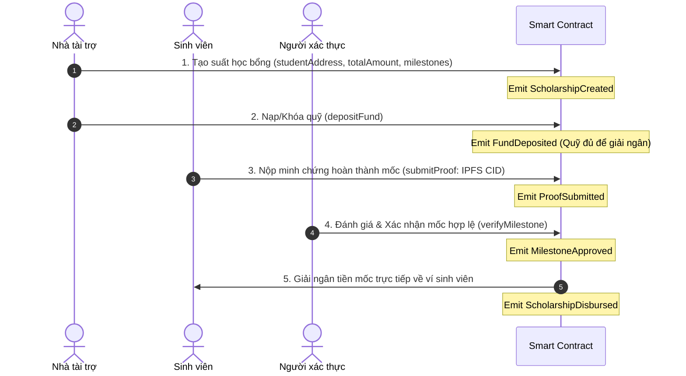

# Đặc Tả Nghiệp Vụ (System Business Specification) - TrustScholar

> **Dự án:** TrustScholar — Giải ngân học bổng minh bạch trên Blockchain  
> **Phiên bản:** v1.0 (Đặc tả nghiệp vụ giải ngân học bổng theo mốc)  
> **Repository:** [LinhHuynhK58KTS](https://github.com/minhkhanhlinh2108-wq/LinhHuynhK58KTS.git)  
> **Tài liệu liên quan:** [PROJECT_PLAN.md](file:///d:/crypto-smart-contract-2026/LinhHuynhK58KTS/docs/PROJECT_PLAN.md) | [ECONOMIC_RULES.md](file:///d:/crypto-smart-contract-2026/LinhHuynhK58KTS/docs/ECONOMIC_RULES.md) | [AI_JOURNAL.md](file:///d:/crypto-smart-contract-2026/LinhHuynhK58KTS/docs/AI_JOURNAL.md)

---

## 1. Mục Đích (Purpose)

Hệ thống **TrustScholar** được thiết kế nhằm xây dựng một giải pháp giải ngân học bổng phi tập trung (decentralized), tự động và minh bạch trên nền tảng EVM Smart Contract. 

Mục tiêu chính:
1. **Minh bạch hóa dòng tiền:** Đảm bảo toàn bộ quỹ học bổng do Nhà tài trợ đóng góp được khóa an toàn trong hợp đồng thông minh, không ai có thể tự ý chiếm đoạt hoặc chuyển sai mục đích.
2. **Giải ngân đúng đối tượng & đúng tiến độ:** Tiền chỉ được chuyển vào đúng ví sinh viên đã đăng ký sau khi sinh viên hoàn thành các mốc học tập/nghiên cứu cụ thể và có xác nhận minh chứng từ người có thẩm quyền.
3. **Chống thất thoát & gian lận:** Loại bỏ khâu trung gian giữ tiền mặt, giảm thiểu nguy cơ phê duyệt cảm tính, đồng thời cung cấp khả năng kiểm toán và truy vết giao dịch 100% on-chain theo thời gian thực.

---

## 2. Đối Tượng Sử Dụng (Target Users)

1. **Nhà tài trợ (Sponsors / Donors):**
   - Các tổ chức doanh nghiệp, cựu sinh viên, quỹ thiện nguyện cá nhân hoặc tổ chức phi chính phủ.
   - Có nhu cầu đóng góp học bổng, thiết lập tiêu chí, nạp tiền và theo dõi tiến độ giải ngân từng mốc.
2. **Sinh viên thụ hưởng (Designated Students / Beneficiaries):**
   - Sinh viên được tuyển chọn nhận học bổng có danh tính ví hợp lệ được gắn với suất học bổng.
   - Có trách nhiệm nộp minh chứng (bảng điểm, chứng chỉ, bài báo khoa học...) theo từng mốc và trực tiếp nhận tiền giải ngân về ví cá nhân.
3. **Người thẩm định / Xác thực (Verifiers / Evaluators):**
   - Đại diện Phòng Đào tạo, Phòng Công tác sinh viên, hoặc Hội đồng chuyên môn của Nhà tài trợ.
   - Có thẩm quyền kiểm tra tính xác thực của minh chứng và phê duyệt mốc giải ngân.
4. **Cộng đồng & Kiểm toán viên (Public Auditors):**
   - Bất kỳ ai muốn theo dõi tính minh bạch của các quỹ học bổng thông qua Blockchain Explorer công khai.

---

## 3. Input (Đầu Vào Của Hệ Thống)

Dữ liệu đầu vào cho các hàm tương tác nghiệp vụ trên Smart Contract bao gồm:

| Chức Năng | Tham Số Đầu Vào (Input Parameters) | Kiểu Dữ Liệu | Ý Nghĩa / Ràng Buộc |
|:---|:---|:---:|:---|
| **Tạo suất học bổng** | `studentAddress` | `address` | Địa chỉ ví sinh viên nhận học bổng (`!= address(0)`). |
| | `totalAmount` | `uint256` | Tổng giá trị học bổng (`> 0`). |
| | `milestoneCount` | `uint256` | Số lượng mốc cần giải ngân (`>= 1`). |
| | `milestoneAmounts` | `uint256[]` | Danh sách số tiền từng mốc (tổng phải bằng `totalAmount`). |
| **Nạp / Khóa quỹ** | `scholarshipId` | `uint256` | Mã định danh duy nhất của suất học bổng. |
| | `msg.value` hoặc `amount` | `uint256` | Số tiền nạp vào quỹ (`> 0`, đủ bù đắp giá trị suất). |
| **Nộp minh chứng** | `scholarshipId` | `uint256` | Mã định danh suất học bổng của sinh viên. |
| | `milestoneIndex` | `uint256` | Thứ tự mốc nộp minh chứng (0-indexed). |
| | `proofHash` (hoặc IPFS CID) | `string` / `bytes32` | Mã băm lưu trữ minh chứng phi tập trung (IPFS/Arweave). |
| **Xác nhận mốc** | `scholarshipId` | `uint256` | Mã định danh suất học bổng. |
| | `milestoneIndex` | `uint256` | Mốc cần phê duyệt đạt yêu cầu. |
| **Giải ngân mốc** | `scholarshipId` | `uint256` | Mã định danh suất học bổng. |
| | `milestoneIndex` | `uint256` | Mốc đã được duyệt, kích hoạt chuyển tiền. |

---

## 4. Output (Đầu Ra Của Hệ Thống)

1. **Thay đổi trạng thái On-chain (State Changes):**
   - Trạng thái suất học bổng cập nhật theo vòng đời: `Created` $\rightarrow$ `Funded` $\rightarrow$ `In-Progress` $\rightarrow$ `Completed` (hoặc `Cancelled`).
   - Trạng thái từng mốc: `Pending` $\rightarrow$ `Submitted` $\rightarrow$ `Approved` $\rightarrow$ `Disbursed`.
   - Cập nhật số dư quỹ: Số dư khả dụng (`balance`) và số tiền đã giải ngân (`disbursedAmount`).
2. **Dòng tiền thực tế (Token/Native Transfers):**
   - Chuyển chính xác số tiền của mốc (`milestoneAmounts[i]`) từ hợp đồng thông minh đến đúng địa chỉ `studentAddress` đã đăng ký.
3. **Nhật ký sự kiện (Blockchain Events):**
   - Các sự kiện chuẩn được phát ra (emit) ghi lại đầy đủ tham số để các ứng dụng Web3 và bộ quét (indexer/subgraph) truy vết:
     - `ScholarshipCreated(uint256 indexed scholarshipId, address indexed sponsor, address indexed student, uint256 totalAmount, uint256 milestoneCount)`
     - `FundDeposited(uint256 indexed scholarshipId, address indexed sponsor, uint256 amount)`
     - `ProofSubmitted(uint256 indexed scholarshipId, uint256 indexed milestoneIndex, address indexed student, string proofHash)`
     - `MilestoneApproved(uint256 indexed scholarshipId, uint256 indexed milestoneIndex, address indexed verifier)`
     - `ScholarshipDisbursed(uint256 indexed scholarshipId, uint256 indexed milestoneIndex, address indexed student, uint256 amount)`

---

## 5. Actor Và Quyền Của Từng Actor

Hệ thống quản lý phân quyền theo vai trò (Role-Based Access Control - RBAC):

| Actor | Vai Trò Kỹ Thuật | Quyền Hạn Thực Thi Trên Contract | Giới Hạn Nghiệp Vụ |
|:---|:---:|:---|:---|
| **Nhà tài trợ (Sponsor)** | `SPONSOR_ROLE` / `scholarship.sponsor` | • Khởi tạo suất học bổng mới.<br>• Nạp quỹ / Khóa tiền vào suất học bổng.<br>• Thu hồi tiền dư nếu suất bị hủy hợp lệ theo chính sách. | • Không được tự ý rút tiền khi mốc đã cam kết và đang trong kỳ xét duyệt.<br>• Không được thay đổi ví sinh viên khi chưa có sự đồng thuận. |
| **Sinh viên (Student)** | `scholarship.student` (Designated Beneficiary) | • Nộp mã băm minh chứng (`proofHash`) cho mốc của chính mình.<br>• Kích hoạt nhận giải ngân (hoặc nhận tiền tự động khi duyệt mốc). | • Chỉ thao tác trên đúng suất học bổng được chỉ định cho mình (`msg.sender == scholarship.student`).<br>• Không thể tự duyệt mốc hoặc sửa số tiền. |
| **Người xác thực (Verifier)** | `VERIFIER_ROLE` | • Thẩm định minh chứng ngoại tuyến và gọi hàm xác nhận mốc hợp lệ (`approveMilestone`). | • Chỉ được xác nhận các mốc đã được sinh viên nộp minh chứng.<br>• Không có quyền tự chuyển tiền quỹ về ví của mình. |
| **Quản trị viên (Admin)** | `DEFAULT_ADMIN_ROLE` | • Cấp phát hoặc thu hồi `VERIFIER_ROLE`.<br>• Kích hoạt tạm dừng khẩn cấp (`pause()`) khi có sự cố kỹ thuật. | • Tuyệt đối **không có quyền** rút tiền của bất kỳ suất học bổng nào (Non-custodial principle). |

---

## 6. Quy Trình Nghiệp Vụ (Business Workflow & Lifecycle)

Quy trình giải ngân học bổng TrustScholar diễn ra qua 5 bước tuần tự chặt chẽ:



### Chi tiết các trạng thái:
1. **Bước 1 - Khởi tạo (Creation):** Nhà tài trợ gọi hàm tạo suất, khai báo địa chỉ ví sinh viên, tổng số tiền và phân bổ số tiền theo từng mốc. Suất ở trạng thái `Created`.
2. **Bước 2 - Khóa Quỹ (Funding):** Nhà tài trợ chuyển tiền (ETH hoặc token) vào hợp đồng tương ứng với giá trị suất. Suất chuyển sang trạng thái `Funded`.
3. **Bước 3 - Nộp Minh Chứng (Proof Submission):** Sinh viên thực hiện kỳ học/mốc cam kết (ví dụ: đạt điểm GPA >= 3.2 sau kỳ 1), tải giấy tờ lên IPFS và gửi `proofHash` lên contract. Mốc chuyển trạng thái `Submitted`.
4. **Bước 4 - Thẩm Định (Verification):** Người có quyền (`VERIFIER_ROLE` hoặc Sponsor) kiểm tra minh chứng. Nếu đạt, gọi hàm xác nhận mốc. Mốc chuyển trạng thái `Approved`.
5. **Bước 5 - Giải Ngân (Disbursement):** Sau khi mốc được xác nhận, Smart Contract tự động (hoặc qua lệnh giải ngân) chuyển đúng số tiền mốc vào ví sinh viên đã đăng ký. Mốc chuyển sang trạng thái `Disbursed`. Khi tất cả các mốc hoàn tất, suất học bổng chuyển sang `Completed`.

---

## 7. Danh Mục Quy Tắc Nghiệp Vụ Cốt Lõi (Rules R1 – R10)

Hệ thống bắt buộc phải thỏa mãn 10 quy tắc sau đây để đảm bảo an toàn tuyệt đối và tính kiểm thử độc lập:

| Quy Tắc | Tên Quy Tắc (Quy Định Tối Thiểu) | Mã Hằng Số Đề Xuất | Nội Dung Chi Tiết & Ràng Buộc Kỹ Thuật |
|:---:|:---|:---:|:---|
| **R1** | **Chỉ nhà tài trợ/người có quyền mới được tạo suất** | `RULE_SPONSOR_ONLY` | Chỉ Nhà tài trợ sở hữu quyền hạn hợp lệ (`SPONSOR_ROLE` hoặc nhà tài trợ được ủy quyền) mới được phép tạo suất học bổng mới. |
| **R2** | **Địa chỉ sinh viên không được là address(0)** | `RULE_VALID_STUDENT_ADDR` | Địa chỉ ví sinh viên nhận học bổng tuyệt đối không được là địa chỉ rỗng: `studentAddress != address(0)`. |
| **R3** | **Số tiền học bổng phải lớn hơn 0** | `RULE_POSITIVE_AMOUNT` | Tổng số tiền học bổng và số tiền phân bổ cho từng mốc bắt buộc phải lớn hơn 0: `totalAmount > 0` và `milestoneAmounts[i] > 0`. |
| **R4** | **Phải có đủ tiền trong quỹ trước khi giải ngân** | `RULE_SUFFICIENT_POOL_FUND` | Trước khi thực hiện giải ngân bất kỳ mốc nào, số dư ký quỹ thực tế trong hợp đồng phải lớn hơn hoặc bằng số tiền của mốc đó: `scholarship.fundedAmount >= scholarship.disbursedAmount + milestoneAmount`. |
| **R5** | **Chỉ sinh viên được đăng ký cho suất mới được nộp minh chứng** | `RULE_STUDENT_SUBMIT_ONLY` | Chỉ đúng địa chỉ ví sinh viên đã được đăng ký cho suất học bổng đó mới có quyền gọi hàm nộp minh chứng: `msg.sender == scholarship.studentAddress`. |
| **R6** | **Chỉ mốc hợp lệ của suất đó mới được xác nhận** | `RULE_VALID_MILESTONE_VERIFY` | Người xác thực chỉ được phê duyệt mốc khi mốc đó thuộc về suất học bổng hợp lệ, mốc đang ở trạng thái đã nộp minh chứng (`Submitted`) và chưa từng được duyệt trước đó. |
| **R7** | **Không được giải ngân khi mốc chưa được xác nhận** | `RULE_NO_UNAPPROVED_DISBURSE` | Smart Contract tuyệt đối không cho phép giải ngân nếu mốc tương ứng chưa chuyển sang trạng thái đã xác nhận hợp lệ: `milestone.isApproved == true`. |
| **R8** | **Một mốc không được giải ngân hai lần** | `RULE_NO_DOUBLE_DISBURSE` | Một mốc học bổng đã giải ngân thành công thì không bao giờ được giải ngân lần thứ hai: `milestone.isDisbursed == false` (bật cờ `true` ngay trước khi chuyển tiền theo mẫu Check-Effects-Interactions). |
| **R9** | **Tiền giải ngân phải đến đúng ví sinh viên đã đăng ký** | `RULE_EXACT_STUDENT_WALLET` | Tiền giải ngân của mốc phải được chuyển trực tiếp vào chính xác địa chỉ ví sinh viên đã lưu trữ trong suất học bổng (`scholarship.studentAddress`), không được chuyển qua ví trung gian hay ví của người gọi lệnh. |
| **R10** | **Các thao tác tạo suất, nạp quỹ, nộp minh chứng, xác nhận mốc và giải ngân phải phát sinh event phù hợp** | `RULE_EMIT_TRACEABLE_EVENTS` | Mọi thao tác trọng yếu (tạo suất, nạp quỹ, nộp minh chứng, xác nhận mốc, giải ngân) bắt buộc phải phát sinh (emit) sự kiện on-chain tương ứng chứa đầy đủ các trường `indexed` cần thiết phục vụ kiểm toán và giám sát (`ScholarshipCreated`, `FundDeposited`, `ProofSubmitted`, `MilestoneApproved`, `ScholarshipDisbursed`). |

---

## 8. Trường Hợp Ngoại Lệ & Mã Lỗi Hệ Thống (Exceptions & Error Handling)

Để đảm bảo gas tối ưu và thông điệp lỗi rõ ràng, hệ thống định nghĩa các lỗi tùy chỉnh (Custom Errors) tương ứng với các tình huống ngoại lệ:

| STT | Tình Huống Ngoại Lệ (Exception Scenario) | Nguyên Nhân Kích Hoạt | Custom Error Đề Xuất | Hành Động Xử Lý |
|:---:|:---|:---|:---|:---|
| 1 | **Người gọi không có quyền** | Tài khoản không có `SPONSOR_ROLE` gọi tạo suất, hoặc không có `VERIFIER_ROLE` gọi duyệt mốc. | `UnauthorizedCaller(address caller, bytes32 requiredRole)` | Revert giao dịch, bảo vệ phân quyền. |
| 2 | **Sai sinh viên** | Địa chỉ ví gọi hàm `submitProof` khác với địa chỉ sinh viên được đăng ký trong suất học bổng. | `NotAssignedStudent(uint256 scholarshipId, address caller, address expectedStudent)` | Revert giao dịch, chống nộp thay/can thiệp minh chứng. |
| 3 | **address(0)** | Khi tạo suất học bổng, tham số `studentAddress` truyền vào là `address(0)` (`0x0000...0000`). | `ZeroAddressNotAllowed()` | Revert giao dịch ngay tại bước khởi tạo. |
| 4 | **Số tiền bằng 0** | Khởi tạo suất học bổng với `totalAmount == 0` hoặc nạp quỹ với `amount == 0`. | `ZeroAmountNotAllowed()` | Revert giao dịch, tránh tạo dữ liệu rác. |
| 5 | **Không đủ quỹ** | Gọi giải ngân khi số dư hợp đồng hoặc số tiền nạp cho suất nhỏ hơn số tiền cần chi trả cho mốc. | `InsufficientScholarshipFund(uint256 available, uint256 requiredAmount)` | Revert giao dịch, bảo vệ toàn vẹn sổ cái quỹ. |
| 6 | **Mốc chưa được duyệt** | Cố gắng gọi giải ngân khi người thẩm định chưa gọi `verifyMilestone`. | `MilestoneNotApprovedYet(uint256 scholarshipId, uint256 milestoneIndex)` | Revert giao dịch, ngăn chặn rút tiền trái phép. |
| 7 | **Mốc đã giải ngân** | Cố tình gọi giải ngân lại một mốc đã nhận tiền trước đó (Double spending/re-entry). | `MilestoneAlreadyDisbursed(uint256 scholarshipId, uint256 milestoneIndex)` | Revert giao dịch theo Check-Effects-Interactions. |
| 8 | **Suất không tồn tại** | Truy vấn hoặc thao tác trên `scholarshipId` vượt quá tổng số suất đã tạo (`id >= totalScholarships`). | `ScholarshipNotFound(uint256 scholarshipId)` | Revert giao dịch với mã lỗi rõ ràng. |
| 9 | **Mốc không tồn tại** | Chỉ số `milestoneIndex` vượt quá số lượng mốc của suất (`index >= milestoneCount`). | `MilestoneIndexOutOfBounds(uint256 index, uint256 maxCount)` | Revert giao dịch. |
| 10 | **Trạng thái mốc không hợp lệ** | Nộp minh chứng cho mốc đã duyệt/đã nhận, hoặc duyệt mốc chưa nộp minh chứng. | `InvalidMilestoneStatus(uint256 scholarshipId, uint256 milestoneIndex, uint8 currentStatus)` | Revert giao dịch. |

---

## 9. Ngoài Phạm Vi (Out Of Scope)

Nhằm đảm bảo dự án tập trung vào cốt lõi minh bạch on-chain và khả thi trong phạm vi đồ án kỹ thuật, các khía cạnh sau được xác định **nằm ngoài phạm vi (Out of Scope)** của hệ thống Smart Contract:

1. **Không xác minh giấy tờ thật ngoài đời (No Physical Document Verification):**
   - Smart Contract chỉ lưu trữ và xử lý mã băm minh chứng (`proofHash` / IPFS CID).
   - Việc kiểm tra tính thật/giả của bằng cấp, giấy chứng nhận hoặc bảng điểm thuộc trách nhiệm ngoại tuyến của Người xác thực (`VERIFIER_ROLE`) trước khi ký giao dịch xác nhận.
2. **Không kết nối trực tiếp hệ thống ERP trường đại học (No University ERP/SIS Live Integration):**
   - Hợp đồng không tích hợp trực tiếp qua API với cơ sở dữ liệu sinh viên nội bộ của các trường học; dữ liệu định danh sinh viên được đưa lên thông qua địa chỉ ví do người có thẩm quyền chỉ định.
3. **Không xử lý tiền pháp định (No Fiat Currency Settlement):**
   - Hệ thống không tích hợp cổng thanh toán ngân hàng (VNPay, Momo, Stripe) hay quy đổi VND/USD trực tiếp trong hợp đồng. Toàn bộ dòng tiền thanh toán sử dụng đồng tiền mã hóa native (ETH) hoặc chuẩn token ERC-20 (USDC/USDT).
4. **Không lưu trữ dữ liệu cá nhân nhạy cảm trực tiếp on-chain (No On-chain PII Storage):**
   - Tuyệt đối không lưu CCCD/CMND, số điện thoại, địa chỉ nhà, học bạ chi tiết trực tiếp lên blockchain để bảo vệ quyền riêng tư người dùng theo tiêu chuẩn an toàn thông tin (GDPR / bảo vệ dữ liệu cá nhân).
5. **Không xây dựng hệ thống quản lý học vụ/học bổng hoàn chỉnh (No Full Scholarship Management Suite):**
   - Dự án không thay thế toàn bộ quy trình xét tuyển học vụ, chấm thi đua, bình xét hoàn cảnh của nhà trường. Dự án chỉ đóng vai trò là tầng cam kết quỹ và giải ngân minh bạch (Commitment & Transparent Disbursement Layer).

---

## 10. Cấu Trúc Dữ Liệu Tham Chiếu Cho Hợp Đồng (Reference Data Structures)

Phác thảo cấu trúc dữ liệu tối giản phục vụ cho giai đoạn thiết kế hợp đồng (Lab 09–10):

```solidity
// Trạng thái của mốc học bổng
enum MilestoneStatus {
    Pending,     // Chờ nộp minh chứng
    Submitted,   // Đã nộp minh chứng, chờ duyệt
    Approved,    // Đã được người có quyền xác nhận
    Disbursed    // Đã giải ngân thành công
}

// Cấu trúc một mốc học bổng
struct Milestone {
    uint256 amount;          // Số tiền giải ngân cho mốc này
    string proofHash;        // Mã băm minh chứng (IPFS CID)
    MilestoneStatus status;  // Trạng thái hiện tại của mốc
    uint256 approvedAt;      // Thời điểm phê duyệt
    uint256 disbursedAt;     // Thời điểm giải ngân
}

// Cấu trúc một suất học bổng
struct Scholarship {
    uint256 id;                 // ID duy nhất của suất học bổng
    address sponsor;            // Địa chỉ Nhà tài trợ tạo suất
    address student;            // Địa chỉ ví sinh viên thụ hưởng
    uint256 totalAmount;        // Tổng giá trị học bổng
    uint256 fundedAmount;       // Số tiền thực tế Nhà tài trợ đã nạp/khóa
    uint256 disbursedAmount;    // Tổng số tiền đã giải ngân đến hiện tại
    uint256 milestoneCount;     // Số lượng mốc
    bool isCompleted;           // Đã hoàn thành toàn bộ mốc hay chưa
}
```

---

## 11. Các Điểm Cần Như Huỳnh Kiểm Tra & Đóng Góp Ý Kiến (Review Checklist for Peer 2)

Nhằm chuẩn bị tốt cho giai đoạn triển khai hợp đồng và viết test suite (Lab 09 - Lab 11), Thành viên 2 (**Trần Thị Như Huỳnh - QA & Testing**) cần rà soát và xác nhận các nội dung sau:

1. **Cơ chế gọi giải ngân mốc (Auto-Disbursement vs. Pull-Claim):**
   - *Phương án A:* Sau khi Verifier gọi `verifyMilestone`, Smart Contract tự động chuyển tiền ngay (`push`).
   - *Phương án B:* Sau khi Verifier duyệt, sinh viên phải chủ động gọi `claimMilestone` để rút tiền (`pull`).
   - *Đánh giá bảo mật:* Phương án B thường an toàn hơn trước các lỗi DoS/reentrancy, nhưng phương án A tiện lợi hơn cho sinh viên. Cần Người 2 chốt phương án trước khi viết Interface tại Lab 09.
2. **Loại tiền tệ giải ngân (Native ETH vs. ERC-20 Stablecoin):**
   - Kiểm tra xem test suite tại Lab 11 sẽ ưu tiên test trên ETH hay mock token ERC-20 (hoặc hỗ trợ cả hai thông qua cấu trúc linh hoạt).
3. **Cơ chế thu hồi quỹ khi sinh viên không đạt mốc (Refund Policy on Milestone Failure):**
   - Nếu sinh viên quá hạn không nộp minh chứng hoặc mốc bị từ chối vĩnh viễn, Nhà tài trợ sẽ được quyền rút lại số tiền còn thừa của các mốc chưa giải ngân theo điều kiện thời gian nào?
4. **Độ dài và định dạng của `proofHash`:**
   - Sử dụng `string` (chứa chuỗi IPFS CID dạng `Qm...` hoặc `bafy...`) hay chuyển sang dạng `bytes32` tối ưu gas?
